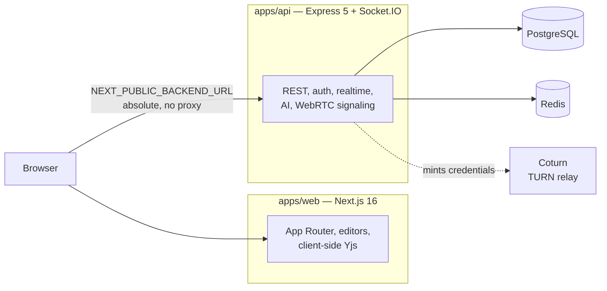

<div align="center">

# ☁️ Nimbus

**The Unified Real-time Collaborative Workspace for Modern Teams**

A comprehensive, highly scalable real-time collaborative workspace unifying rich document editing, infinite canvas whiteboarding, and embedded AI assistance.

[](https://opensource.org/licenses/MIT)
[](https://nextjs.org/)
[](https://turbo.build/)
[](http://makeapullrequest.com)

[Live Demo](https://nimbus.tejasnasa.me) · [Report Bug](https://github.com/tejasnasa/nimbus/issues) · [Request Feature](https://github.com/tejasnasa/nimbus/issues)

</div>

---

## 🌟 Why Nimbus?

In a world where remote work and asynchronous communication are the norm, context switching between tools kills productivity. **Nimbus** eliminates the friction by combining your text documents, whiteboard diagrams, instant chat, voice calls, and an AI assistant into a single, cohesive environment.

Designed for **scale and performance**, Nimbus handles thousands of concurrent users in real-time, making it the perfect choice for enterprises, open-source communities, and fast-moving startups.

---

## ✨ Enterprise-Grade Features

### 🔄 Real-Time Collaboration at Scale

- **Two sync models, chosen per workload** — Rich-text documents are a true CRDT (Yjs), so concurrent typing merges character-by-character and nobody's keystrokes are lost. Canvases are full-state, last-write-wins, because diagram elements are discrete objects where "the last drag wins" is the outcome a user expects. The split is deliberate — see [docs/document-sync.md](docs/document-sync.md).
- **High-Throughput WebSockets** — Built on Socket.io with an `ioredis` adapter, so broadcasts fan out across multiple Node.js instances.
- **Presence, typing and voice rosters in Redis** — Ephemeral state lives in Redis with a TTL guard rather than in a single process's memory.
- **Honest scaling story** — Document and canvas state is process-local today, so a multi-replica deployment needs sticky sessions or a shared Yjs store. [docs/document-sync.md](docs/document-sync.md#scaling) explains the failure mode and both fixes.

### 📝 Integrated, Powerful Editors

- **Rich-Text Document Editor (Milkdown)** — A beautiful, highly extensible Markdown editor that natively syncs via Yjs. Supports slash commands, embeddable blocks, and collaborative cursors.
- **Infinite Canvas Whiteboarding (Excalidraw)** — Sketch diagrams, build flowcharts, or wireframe UIs on an infinite canvas seamlessly embedded into your workspace.

### 🎙️ Native WebRTC Voice Rooms

- **Zero-Latency Audio** — Embedded audio rooms per workspace using peer-to-peer WebRTC connections for instant team standups.
- **TURN Relay Infrastructure** — Integrated Coturn TURN relay server configuration to bypass firewalls and ensure stable peer connections on restricted networks.
- **Seamless UX** — Toggle voice chat inside any channel with a single click without leaving your active workspace.

### 🤖 Intelligent AI Assistance & Generation (@NimbusBot)

- **Bring your own key, or use the free tier** — Add a key for OpenAI, Groq, DeepSeek or OpenRouter and choose the model per feature (chat replies, Markdown documents, canvas diagrams). Users without a key fall back to the operator's free tier, metered at a configurable number of free document generations.
- **AI Document Generation** — Mention `@nimbusbot` in chat to draft a rich Markdown document or a structured Excalidraw diagram. Markdown streams straight from the model; canvases go through a JSON → validate → layout → Excalidraw pipeline, so the geometry is computed deterministically instead of guessed by the model. See [docs/document-generation.md](docs/document-generation.md).
- **Credentials encrypted at rest** — BYOK keys are sealed with AES-256-GCM in an envelope format, bound to their owning user and provider, with key-rotation support. The plaintext key is never stored, and a save-time probe validates a key before it is persisted.
- **Context-Aware Companion** — NimbusBot reads the last 20 workspace messages to answer in context, and runs detached from the chat path so a slow model never delays message delivery.

### 🔒 Security & Privacy

- **Robust Authentication** — Better-Auth with email + password (verification required) and Google OAuth, server-validated sessions, and per-device session management from the settings page.
- **Granular RBAC** — `OWNER > ADMIN > MEMBER`, enforced in the controller layer with an immutable sole owner. Socket handlers re-check workspace membership on every event, so a revoked member loses access immediately.
- **Encrypted Credentials** — User-supplied AI keys are sealed with AES-256-GCM, bound to their owner and provider, and never written in plaintext.
- **Data Sovereignty** — Self-hostable architecture gives you complete control over where your data lives.

### 👤 Account & Workspace Management

- **Account settings** — A dedicated `/settings` page with Profile, Password, Sessions, AI and Danger Zone tabs.
- **Avatars** — Upload, replace or remove a profile picture, stored on Cloudinary via signed direct uploads with a deterministic per-user asset id.
- **Password & recovery** — Change your password (optionally signing out every other device), or complete a full forgot-password reset by email. Google-only accounts are offered a "set a password" link instead of a form they cannot fill in.
- **Active sessions** — See each signed-in device with a parsed user-agent, IP and last-active time; revoke one, or sign out of all others at once.
- **Account deletion** — Typed-email confirmation plus password re-auth, cascading every solely-owned workspace along with its documents and messages, and cleaning up the avatar asset.
- **Contact** — A public, unauthenticated contact form with honeypot spam protection that emails the operator directly.

---

## 🛠 Tech Stack

Nimbus leverages a modern, robust tech stack designed for high availability and rapid iteration.

| Layer              | Technology                                          | Description                                                                                                 |
| ------------------ | --------------------------------------------------- | ----------------------------------------------------------------------------------------------------------- |
| **Framework**      | Next.js 16 (App Router)                             | React framework for production-grade React applications.                                                    |
| **Monorepo**       | Turborepo                                           | High-performance build system for JS/TS codebases.                                                          |
| **Backend**        | Node.js + Express                                   | Lightweight, fast backend for API and WebSocket handling.                                                   |
| **Real-Time**      | WebSockets (Socket.io) + Yjs                        | Real-time bi-directional event-based communication.                                                         |
| **Voice Chat**     | WebRTC + Coturn TURN                                | Peer-to-peer voice channel relay with a TURN fallback for restricted networks.                              |
| **AI Layer**       | Multi-provider (OpenAI, Groq, DeepSeek, OpenRouter) | Per-feature model selection, BYOK or operator free tier, streamed Markdown and structured JSON whiteboards. |
| **Database**       | PostgreSQL                                          | Robust, scalable relational database (managed via Prisma).                                                  |
| **Cache/PubSub**   | Redis (ioredis)                                     | Presence, typing, voice rosters, and WebSocket broadcast fan-out.                                           |
| **File Storage**   | Cloudinary                                          | Signed direct avatar uploads with a deterministic per-user asset id.                                        |
| **Email**          | Resend                                              | Signup verification, password reset, and contact-form delivery.                                             |
| **Authentication** | Better-Auth                                         | Comprehensive authentication and authorization.                                                             |
| **UI & Styling**   | Tailwind CSS + Framer Motion                        | Utility-first CSS framework and animation library for fluid UX.                                             |

---

## 🚀 Getting Started

Want to run Nimbus locally or contribute to the project? Follow these steps.

### Prerequisites

- **Node.js** 18.x or later
- **PostgreSQL** 14+
- **Redis** 6+ (Required for WebSocket multiplexing)
- **Git**

### Local Development Setup

1. **Clone the repository**

   ```bash
   git clone https://github.com/tejasnasa/nimbus.git
   cd nimbus
   ```

2. **Install dependencies**

   ```bash
   npm install
   ```

3. **Environment Configuration**
   Copy the example environment file and fill in your database, Redis and auth credentials. It lists
   every variable the API reads, splits required from optional, and explains the ones with non-obvious
   behaviour.

   ```bash
   cp .env.example .env
   ```

4. **Database Migration**
   Create and apply the schema, and generate the Prisma client.

   ```bash
   npx turbo run db:migrate
   ```

5. **Start the Development Server**

   ```bash
   npm run dev
   ```

   _The web client is available at `http://localhost:3000` and the API/WebSocket server at `http://localhost:3001`._

   Note that the browser reaches the API directly via `NEXT_PUBLIC_BACKEND_URL` — there are no Next.js
   route handlers proxying to it, and no `app/api` directory.

---

## 🧪 Running Tests

Tests are orchestrated by Turborepo and sharded by workspace. Integration and
smoke suites run against **real** Postgres and Redis (never mocks) — only external
APIs such as Groq, OpenAI, and Resend are stubbed.

```bash
# 1. Start the test Postgres + Redis (host ports 5434 / 6381)
docker compose -f docker-compose.test.yml up -d

# 2. Apply the Prisma schema to the test database
#    (needed on first run, and after pulling a migration)
npx turbo run db:deploy --filter=@nimbus/db

# 3. Run everything
npm test
```

`make` wraps the same steps — run `make help` for the full list:

```bash
make test-infra-up   # start Postgres + Redis
make test-schema     # apply migrations to the test DB
make test            # all suites, turbo cache bypassed
make test-suite SUITE=smoke   # one API shard
```

Run a narrower slice directly:

```bash
npx turbo run test --filter=api     # API only
npx turbo run test --filter=web     # web only

cd apps/api && npx vitest run src/__tests__/smoke                # one shard
cd apps/api && npx vitest run src/__tests__/smoke/boot.test.ts   # one file
```

Test configuration lives in the committed `.env.test` (throwaway local values, not
secrets). API suites are selected by directory — `src/__tests__/{smoke,unit,integration,security}`
— which is also how CI shards them.

Two suites need the database for different reasons, so they use **different databases**
on the same server: `apps/api` runs against `nimbus_test`, and `packages/database` creates
and migrates its own `nimbus_schema_test` before its workers start. They used to share one,
and `apps/api`'s per-test `TRUNCATE` would wipe the schema suite's fixtures mid-assertion.

### Coverage

Each package carries a `.coverage-floor` file, and
`node scripts/check-coverage.mjs <package-dir>…` fails if a package has dropped below it.
It is a ratchet rather than a target: the floor is whatever the package last achieved, so
coverage can only fall if someone edits the floor deliberately in review.

```bash
make test-coverage         # every suite with coverage
make test-coverage-check   # the same, then fail on any regression
```

### End-to-end

`make test-e2e` runs the Playwright suite in `apps/web/e2e` against chromium. It
seeds the test database, starts both processes itself, and drives real browsers, so
it is slower than everything above and runs nightly in CI rather than on every PR.

```bash
make test-e2e        # start Postgres + Redis, seed, boot both servers, run
make test-e2e-seed   # re-seed the fixtures without running the suite
```

Two things are worth knowing before editing these specs. The auth cookie is pinned
to `Domain=.tejasnasa.me` in production config, which a browser will not store from
`localhost`; `e2e/auth.setup.ts` therefore signs in over the HTTP API and re-scopes
the cookie, and specs that need a second identity ask for the `memberPage` fixture
instead of filling in the sign-in form. And the API is started with
`DOTENV_CONFIG_PATH` pointing at `.env.test`, which is what keeps the suite off any
real database — do not remove it.

### Production smoke suite

A second, separate Playwright suite (`apps/web/e2e-prod`, nightly at 04:41 UTC) drives the **deployed**
site rather than a local stack: it signs in through the real form, creates a workspace, and exercises
document persistence, chat delivery, real-time sync, NimbusBot replies and RBAC against production. It
has its own config with no `webServer` and no seeding, and refuses to start unless the target is an
allowlisted host over HTTPS. Traces are deliberately off there, because a trace records form `fill`
values — which for sign-in means the password.

[docs/testing.md](docs/testing.md) is the long-form guide to all of it: fixtures, the defects once
pinned as `it.fails` markers, and troubleshooting.

---

## 🏗 Architecture Overview

Nimbus runs as **two processes** that share code only through `packages/*`:



The API owns every piece of persistence, authentication, and realtime coordination — the web app
renders and talks to it directly. There is no Next.js `app/api` directory.

Nimbus uses a monorepo structure managed by Turborepo, separating concerns while maintaining shared type safety.

```text
nimbus/
├── apps/
│   ├── web/                  # Next.js 16 client — App Router, UI, client-side Yjs (port 3000)
│   └── api/                  # Express 5 + Socket.IO — persistence, auth, realtime, AI, signaling (port 3001)
├── packages/
│   ├── database/             # Prisma schema, migrations and client (package name: @nimbus/db)
│   ├── ui/                   # Shared React components and design system
│   ├── types/                # Socket event contract, API types, Zod validation schemas
│   ├── utils/                # Pure helpers (model selection, slugs, time formatting)
│   ├── eslint-config/        # Shared ESLint configuration
│   └── typescript-config/    # Shared tsconfig bases
├── docs/                     # Architecture and subsystem documentation
└── turbo.json                # Turborepo orchestration and caching rules
```

Note the package name differs from the directory: `@nimbus/db` lives in `packages/database/`.

---

## 📚 Documentation

Nimbus is documented subsystem by subsystem in [`docs/`](docs/). Each page explains not only how
something works, but **why it was built that way and what the alternatives were** — the trade-offs
are written down rather than left implicit.

**Start here**

| Document                                   | Covers                                                                                                         |
| ------------------------------------------ | -------------------------------------------------------------------------------------------------------------- |
| [Architecture](docs/architecture.md)       | The two-process model, the monorepo graph, one request traced end to end, and where every kind of state lives. |
| [Getting Started](docs/getting-started.md) | Local setup, every environment variable, the turbo env contract, code conventions, troubleshooting.            |

**Subsystems**

| Document                                           | Covers                                                                                                                                                    |
| -------------------------------------------------- | --------------------------------------------------------------------------------------------------------------------------------------------------------- |
| [API](docs/api.md)                                 | REST conventions, the response envelope, the full endpoint reference, and the RBAC model.                                                                 |
| [Realtime](docs/realtime.md)                       | The socket layer: handshake auth, the event contract, presence, typing, voice signaling, and scaling.                                                     |
| [Document Sync](docs/document-sync.md)             | The two sync models — Yjs CRDT for Markdown, last-write-wins for canvas — plus persistence, eviction races, and what breaks when you scale out.           |
| [Document Generation](docs/document-generation.md) | The `@nimbusbot` pipeline end to end: entitlements, the atomic quota claim, streamed Markdown, and the canvas JSON → validate → layout → Excalidraw path. |
| [AI Subsystem](docs/ai.md)                         | The provider registry, model selection, encrypted credential storage, the save-time probe, and the free-tier quota.                                       |
| [Data Model](docs/data.md)                         | Every Prisma model and enum, cascade and deletion order, the migration history, and debounced persistence.                                                |
| [Frontend](docs/frontend.md)                       | Route map, the no-state-library model, the socket singleton, the editor ref bridge, and the Tailwind v4 token system.                                     |
| [Operations](docs/operations.md)                   | Deployment topology, the Docker image, all four CI/CD workflows, the security model, and a runbook.                                                       |
| [Testing](docs/testing.md)                         | Every suite — API shards, web, packages, end-to-end, and the production smoke run — plus fixtures, the coverage ratchet and CI.                           |

---

## 🤝 Contributing

We welcome contributions from the community! Whether it's a bug fix, new feature, or documentation improvement, your help makes Nimbus better.

1. Fork the Project
2. Create your Feature Branch (`git checkout -b feature/AmazingFeature`)
3. Commit your Changes (`git commit -m 'Add some AmazingFeature'`)
4. Push to the Branch (`git push origin feature/AmazingFeature`)
5. Open a Pull Request

Please read our [CONTRIBUTING.md](CONTRIBUTING.md) for details on our code of conduct and the process for submitting pull requests.

---

## 🛡 Security

If you discover a security vulnerability within Nimbus, please send an e-mail to tejasnasa1908@gmail.com. All security vulnerabilities will be promptly addressed.

---

## 📄 License

Distributed under the MIT License. See `LICENSE` for more information.

---

<div align="center">

**Built with ❤️ for teams everywhere by [Tejas Nasa](https://github.com/tejasnasa)**

[](https://github.com/tejasnasa)
[](https://twitter.com/tejasnasa)

</div>
