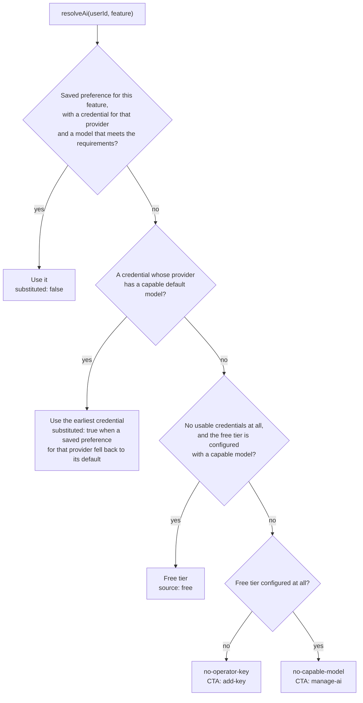

# AI Subsystem

Nimbus has three AI call sites — **chat replies**, **Markdown documents**, and **canvas diagrams** —
and every one of them can run on either the user's own API key or the operator's free tier. This page
covers the machinery that makes that possible: the provider registry, the resolution chain that picks
a model, encrypted credential storage, the save-time probe, the client factory, and the free-tier
quota.

The generation pipeline itself — what happens after a model is chosen — is in
[document-generation.md](document-generation.md).

## Contents

- [The shape of the problem](#the-shape-of-the-problem)
- [The provider registry](#the-provider-registry)
- [Choosing a model](#choosing-a-model)
- [Resolving a client](#resolving-a-client)
- [Credential storage](#credential-storage)
- [The save-time probe](#the-save-time-probe)
- [The client factory](#the-client-factory)
- [The free-tier quota](#the-free-tier-quota)
- [The REST surface](#the-rest-surface)
- [The client side](#the-client-side)
- [Design decisions and trade-offs](#design-decisions-and-trade-offs)
- [Related documentation](#related-documentation)

## The shape of the problem

A naive implementation of "the app uses an LLM" is one module-level client built at import time from
an environment variable. That design breaks as soon as you need any of:

- **Per-user keys.** A user's key must reach the call site, and the app must boot without it.
- **Multiple providers.** OpenAI, Groq, DeepSeek and OpenRouter speak the same API shape but differ
  in base URL, model catalog, and — importantly — which request parameters they accept.
- **Per-feature model choice.** A user may want a cheap fast model for chat and a stronger one for
  long documents.
- **A metered free tier.** Users without a key should still be able to try the feature, on the
  operator's key, up to a limit.

Roughly: `packages/types/src/ai/providers.ts` holds the registry, `packages/utils/src/ai/selectModel.ts`
holds the pure selection logic, and `apps/api/src/lib/ai/*` holds the side-effecting pieces. That
split is deliberate — the pure module is exhaustively unit-testable with table-driven cases and has no
database, env, or SDK dependency.

## The provider registry

`packages/types/src/ai/providers.ts` is the single source of truth for providers, their base URLs,
their model catalogs, and each model's capabilities:

```ts
export const AI_PROVIDER_IDS = [
  "openai",
  "groq",
  "deepseek",
  "openrouter",
] as const;
```

Each provider carries a base URL, a docs URL, a key-acquisition URL, and a `defaultModel`. Each model
carries an id, a label, and a capability list. Capabilities are what the rest of the system reasons
about rather than hardcoding model names:

| Capability         | Meaning                                                      |
| ------------------ | ------------------------------------------------------------ |
| `reasoning`        | The model accepts a `reasoning: { effort }` parameter at all |
| `reasoningSummary` | The model also accepts `reasoning: { summary }`              |

Features declare what they require:

```ts
export const AI_FEATURE_REQUIREMENTS: Record<
  AiFeature,
  readonly AiCapability[]
> = {
  /* … */
};
export const AI_FEATURE_RECOMMENDED: Record<
  AiFeature,
  readonly AiCapability[]
> = {
  /* … */
};
```

`meetsRequirements(model, feature)` is the check everything else calls. Requirements are **hard** —
a model that fails them cannot be used for that feature. Recommended capabilities are **soft** — they
inform the picker but do not block selection.

This indirection is what lets a new provider be added by editing one file: the picker, the resolver,
and the generators all read capabilities rather than enumerating model names.

## Choosing a model

`selectModelForFeature` in `packages/utils/src/ai/selectModel.ts` is pure — no DB, no env, no SDK, no
logger. It takes the user's preferences, their credentials, and the operator's free tier, and returns
either a `SelectedModel` or a `SelectionRefusal`. The whole chain, as a decision tree:



The precedence chain, in order:

1. **The feature's saved preference**, if the user has a credential for that provider and the chosen
   model meets the feature's requirements. This is the honoured path — the user asked for this model
   and gets it.
2. **Fall through, not refuse.** If the preference names a provider the user has no credential for,
   or a model that no longer meets requirements (the registry changed), selection continues rather
   than failing. A stale preference should degrade, not break the feature.
3. **The user's primary credential** — earliest `createdAt`, then `id` as a tiebreak — using that
   provider's `defaultModel`. If that provider has no capable model, the next credential is tried in
   order. This is where `substituted: true` is set, meaning: _the user expressed a preference and we
   are not honouring it, so the UI should say so._
4. **The free tier**, but **only when the user has no usable credentials at all.** A user with a key
   never consumes the operator's allowance.
5. **Refusal** — `no-key` when there are no credentials and no free tier; `no-capable-model`
   otherwise.

Two details in that function are easy to miss and both matter:

- **Only credentials whose provider is still in the registry count.** A stale row pointing at a
  retired provider cannot construct a client, so it does not count as "has a key" when deciding
  whether the free tier applies.
- **The ordering is deterministic** (`createdAt`, then `id`). Without the tiebreak, two credentials
  created in the same millisecond could select differently on different calls, which would make the
  system non-reproducible in a way that is very hard to debug.

## Resolving a client

`resolveAi(userId, feature)` in `apps/api/src/lib/ai/entitlements.ts` is the wrapper that adds the
side effects. It composes four things and adds no selection logic of its own:

1. `selectModelForFeature` — the pure precedence chain above.
2. `lib/ai/providers` — the registry and the operator's free-tier env view.
3. `lib/ai/credentialCrypto` — envelope decryption.
4. `lib/ai/clientFactory` — SDK client construction.

It reads the user's credentials and preferences in parallel, maps them to the selector's view types,
and then either builds a handle or returns a curated refusal.

**The resolver makes no network call.** Every refusal it produces is a _configuration state_, not a
runtime failure — which is why its reason union excludes the two reasons that can only be known after
a request:

```ts
export type AiRefusalReason =
  | "no-key"
  | "free-tier-exhausted"
  | "no-operator-key"
  | "no-capable-model";
```

`invalid-key` and `provider-error` are produced at call time by `classifyClientError`, after a request
has actually failed.

The resolver is also where the pure selector's two reasons get refined into four. The selector only
knows `no-key` and `no-capable-model` — it cannot read env, so it cannot tell "this user has no key"
from "this deployment has no free tier configured at all". The resolver layers that on:

| Selector reason    | Operator state          | Final reason       | CTA       |
| ------------------ | ----------------------- | ------------------ | --------- |
| `no-key`           | no free tier configured | `no-operator-key`  | add-key   |
| `no-key`           | free tier configured    | `no-key`           | add-key   |
| `no-capable-model` | —                       | `no-capable-model` | manage-ai |

The `no-capable-model` case points at **manage-ai** rather than **add-key** for a good reason: the
credential row already exists, so telling the user to add a key would be wrong advice. They need to
pick a different model or add a credential for a provider whose models qualify.

### The free-tier capability caveat

There is one asymmetry the module is explicit about: **free-tier capabilities are assumed, not
enforced.** The operator's free model is configured through `AI_PROVIDER` / `AI_MODEL` and may name a
model that is not in the curated registry, so its declared capabilities cannot be trusted the way a
registry model's can. The resolver logs exactly one `warn` per process about this — one, because a
deployment that has not opted into the registry will not change, and a flood of identical warnings
would bury the first.

## Credential storage

A user pasting their own API key is trusting Nimbus with a credential that can spend their money, so
keys are encrypted at rest with **AES-256-GCM** in `apps/api/src/lib/ai/credentialCrypto.ts`.

The stored envelope is a self-describing string:

```text
nimbus1.<keyId>.<ivB64>.<tagB64>.<ctB64>
```

- **`nimbus1.`** — the format version prefix. Decryption refuses anything without it, which makes a
  future format change explicit rather than silent.
- **`keyId`** — `sha256(derivedKey).slice(0,8)`, a _hint_ identifying which master key encrypted the
  row. Rotation needs no bookkeeping: decrypt with the current key, and if the id does not match, try
  each key in `AI_CREDENTIAL_ENCRYPTION_KEY_PREVIOUS`.
- **`iv`, `tag`, `ct`** — the nonce, GCM auth tag, and ciphertext.

The master key is a ≥32-character passphrase in `AI_CREDENTIAL_ENCRYPTION_KEY`, run through
**HKDF-SHA256** with a domain-separated salt and info string to derive a 32-byte AES key. Boot
validation is `min(32)` rather than "base64 decoding to exactly 32 bytes" — that accepts an
`openssl rand -base64 32` value _and_ a long passphrase, rejects short values loudly, and avoids an
"invalid base64" failure mode.

### AAD binds the row to its owner

The GCM additional authenticated data is:

```text
ai-credential:v1:<userId>:<providerId>
```

This closes the **row-swap attack** that unbound ciphertext allows. If someone with database access
copied user A's credential row onto user B — or moved it to a different provider — decryption fails
the auth-tag check rather than yielding a usable key. The AAD is not a separate integrity field; it is
part of what GCM authenticates.

### What the threat model actually is

The module is honest about its own limits, and it is worth repeating here because overstating it is a
real risk:

> The process holds the master key in its environment, so anyone with read access to the running
> container's env, a memory dump, or a database dump **plus** the master key can decrypt every stored
> key.

What encryption at rest buys is **blast-radius reduction for the realistic incident**: a leaked
backup, a read-only SQL injection, a `SELECT *` in a support tool, a stray log line. It is **not** a
vault — no per-user encryption, no HSM, no re-authentication before use. The module's own doc comment
says UI copy must not imply otherwise.

### The non-negotiables

The module lists operations that must never happen. They are the kind of rule that is obvious in
review and easy to violate by accident:

- Never log the plaintext, the envelope, or the derived master key.
- Never put plaintext or key bytes in an error message — **including inside `new Error(msg, { cause })`**,
  because some loggers stringify the cause.
- Never accept an envelope without the `nimbus1.` prefix.
- Never invent a default or "no encryption" key when the env var is missing.
- Never export anything that returns a plaintext key to an HTTP layer — the DTO type has no field for
  it, so a leak would be a compile error.
- Never use a non-AEAD mode or a static IV.

### Masked previews

Stored credentials are displayed as `sk-…4f2a` — three characters of head, an ellipsis, four of tail.
The mask is **not** a security boundary (it lives in the database in plaintext, and the real key is
one decrypt away), but it prevents shoulder-surfing a screenshot of the settings panel. When a key is
shorter than 12 characters, the mask shows the same number of dots instead of the head and tail, so
nothing leaks at all.

`keyFingerprint` — `sha256(apiKey).slice(0,16)` — is the non-reversible _ledger identity_. It lets the
system dedupe and identify a credential without ever handling the secret, and it is never returned
over HTTP.

## The save-time probe

`apps/api/src/lib/ai/probe.ts` verifies a key **before it is stored**, with a real request:

```ts
await client.responses.create({
  model: model.id,
  input: "hi",
  ...reasoningKwargs(tempHandle, effort),
  max_output_tokens: 16,
});
```

Four properties of the probe are deliberate:

- **It sends the same request shape a real call would.** A probe that sends a simpler request verifies
  the wrong thing — it would pass for a key that works for `hi` but fails on the actual call.
- **`timeout: 15_000`** — short enough that a hung provider does not stall a human filling in a form,
  long enough that a slow first request still completes.
- **`maxRetries: 0`** — a probe that retries is hiding a real failure.
- **`max_output_tokens: 16`** — the cheapest meaningful call.

Failures map to curated, user-visible messages by HTTP status, never by SDK error class, so an SDK
bump that renames classes does not break the mapping:

| Status    | Reason            | Message                                      |
| --------- | ----------------- | -------------------------------------------- |
| 401 / 403 | `incorrect-key`   | "Incorrect API key."                         |
| 404       | `model-not-found` | "That model isn't available on {provider}."  |
| _(none)_  | `unreachable`     | "Could not reach {provider}."                |
| other     | `unknown-error`   | "{provider} could not validate the request." |

A missing status means a transport failure — DNS, connection refused, timeout — which is exactly what
the SDK reports without a status.

**Store only on success.** A half-saved credential is worse than none, because the UI would show a row
the resolver then refuses to use. The controller enforces this by gating the upsert on `ok: true`.

## The client factory

`apps/api/src/lib/ai/clientFactory.ts` is the single module in the app that constructs SDK clients.
It exists because of a specific former design: `groqClient.ts` and `openaiClient.ts` used to be
module-level `new OpenAI(...)` singletons built at import time, and the SDK **throws when the key is
absent** — so those env vars had to be required, and a process without them could not boot. The
factory removes that requirement by taking the key as an argument and constructing lazily.

The handle it returns is what the generators receive:

```ts
export type AiClientHandle = {
  readonly providerId: string;
  readonly modelId: string;
  readonly source: "byok" | "free";
  readonly supportsReasoning: boolean;
  readonly client: OpenAI;
};
```

The handle is the seam that makes BYOK work without a single branch inside the generators. A call site
does `handle.client.responses.create({ model: handle.modelId, ... })` and never knows or cares whose
key paid for it.

### A bounded cache

Constructing a client per message would be wasteful, so there is a cache keyed by
`` `${providerId}|${keyFingerprint}|${modelId}` `` — deliberately the _fingerprint_, not the key, so
the cache holds the least identifying material it can while still keeping two credentials for the
same provider distinct.

- **50 entries max**, evicting the oldest expiry on overflow.
- **10-minute TTL** — long enough to amortise construction across a conversation, short enough that a
  credential the user just deleted stops being usable promptly.

### `reasoningKwargs` — the per-provider request shaping

This is the one piece of request shaping call sites cannot decide on their own, because it depends on
what the _model_ accepts:

| Model capability                   | What is sent                                                                                                                  |
| ---------------------------------- | ----------------------------------------------------------------------------------------------------------------------------- |
| no `reasoning`                     | `{}` — the parameter would 400                                                                                                |
| `reasoning`, no `reasoningSummary` | `{ reasoning: { effort } }` — Groq's gpt-oss rejects `summary` outright with `400 Field 'reasoning.summary' is not supported` |
| both                               | `{ reasoning: { effort, summary: "detailed" } }`                                                                              |

Callers pass an effort level, and both the bot and the generators request `low` explicitly rather than
accepting the provider default. Two reasons, both real: the default is unstated and differs per
provider (so behaviour would be unpredictable), and reasoning tokens count against
`max_output_tokens`, so a higher level can spend most of a reply's budget before the answer starts.
`low` is the cheapest level **every verified provider accepts** — DeepSeek does not accept `minimal`.

### The error classifier

SDK errors are mapped to curated reasons, by status rather than by class:

- **401, 403** → `invalid-key` (a key without the required scope is still the user's problem)
- **everything else** → `provider-error`

The raw SDK message never reaches the user, because **some SDK error formats echo request parameters —
including the key**. This is a security property, not a nicety: a provider's error text is untrusted
output that may contain a secret, so it is logged nowhere and returned nowhere.

## The free-tier quota

Users without a credential fall back to the operator's key, metered by
`apps/api/src/lib/ai/quota.ts`. Chat replies are unlimited; **document generations** are counted.
The counter is `User.freeDocGenerationsUsed` and the limit comes from `AI_FREE_DOC_LIMIT` (default 5).

The claim is one conditional update, and it is race-safe by construction:

```ts
const result = await prisma.user.updateMany({
  where: { id: userId, freeDocGenerationsUsed: { lt: limit } },
  data: { freeDocGenerationsUsed: { increment: 1 } },
});
```

Postgres takes the row lock; a losing concurrent request waits; when it proceeds, the `WHERE` is
re-evaluated against the already-incremented row and matches nothing. So `count === 0` is the
authoritative exhausted signal.

This is why there are two functions with different jobs:

- **`readQuotaState`** — cheap, no lock, for the status endpoint. Can be a generation stale under
  concurrency. Its job is honest UX, not correctness.
- **`claimFreeDocGeneration`** — atomic, authoritative. Its job is correctness.

The rule that follows: **a refused claim is a quota-exhausted refusal, never a UI bug.** A read that
said "1 remaining" can be beaten to the slot by a concurrent request.

`refundFreeDocGeneration` is the mirror image — `decrement` guarded by `{ gt: 0 }` so the counter can
never go negative. It exists so a provider-side failure does not burn one of the user's free
generations. It is bounded rather than general-purpose: a refund only returns what _this call_ spent,
gated on a boolean in the detached scope, and only a provider failure reaches it.

The full claim-then-announce ordering is in
[document-generation.md](document-generation.md#stage-3--the-quota-claim).

## The REST surface

`apps/api/src/routers/ai.router.ts` mounts under `/api/ai`, behind `authCheck`:

| Method   | Path                       | Purpose                                                                          |
| -------- | -------------------------- | -------------------------------------------------------------------------------- |
| `GET`    | `/status`                  | Everything the UI needs: enablement per feature, quota, credentials, preferences |
| `GET`    | `/credentials`             | List credentials as DTOs (masked preview only)                                   |
| `POST`   | `/credentials`             | Probe, then encrypt and upsert                                                   |
| `DELETE` | `/credentials/:providerId` | Remove a credential and its now-dangling preferences                             |
| `GET`    | `/preferences`             | The saved provider+model per feature                                             |
| `PUT`    | `/preferences`             | Validate capability, then upsert a preference                                    |

This surface is deliberately **not workspace-scoped**, and the RBAC ladder does not apply to it.
Ownership is enforced at the query level — every read and write is scoped by `where: { userId }` — so
a credential that is not yours is not found rather than forbidden:

- `deleteAiCredential` returns **404**, never 403, for a row that is not the caller's. The response
  does not reveal whether the row exists for someone else.
- `upsertAiCredential` returns **400** when the probe refuses, and the stored row is left untouched.
- `upsertAiPreference` returns **422** for an unknown provider, unknown model, a model that does not
  meet the feature's requirements, or a provider the user has no credential for. That last one is the
  useful error: "No credential saved for provider … Add an API key first."

Deleting a credential also clears the preferences pointing at it, so the user is never left in a UI
state the resolver cannot honour.

## The client side

- **`AccountSettings.tsx`** hosts the settings page with Profile, Password, Sessions, AI and Danger
  Zone tabs.
- **`AiSettingsPanel.tsx`** is the AI tab: the free-tier summary ("X of Y document generations
  remaining"), the credential list with masked previews and add/replace/remove, and the per-feature
  model pickers.
- **`AiModelPicker.tsx`** renders provider and model comboboxes per feature, filtering by capability —
  and saves immediately on change rather than behind a submit button.
- **`ApiKeyDialog.tsx`** is the add/replace modal. The plaintext key field is cleared on success and on
  close, so the secret does not sit in component state after it has been sent.
- **`AiRefusalBanner.tsx`** appears next to the chat composer when the user's AI is unavailable,
  carrying the `cta` the server sent (`add-key` or `manage-ai`).
- **Hooks** — `useAiStatus`, `useAiCredentials`, `useAiPreferences`, `useAddApiKeyForm`.

The status shape is server-seeded: `app/settings/page.tsx` fetches `getAiStatus()` and passes it into
`AccountSettings` as `initialAiStatus`, so the panel renders populated rather than flashing an empty
state. `apps/web/api/ai.ts` never throws — it resolves to a disabled-everything fallback on failure,
so an API outage degrades the settings page rather than crashing it.

## Design decisions and trade-offs

### Why split pure selection from the resolver?

Because the precedence chain is the part with all the edge cases — stale preferences, retired
providers, capability mismatches, free-tier fallback — and it is the part that is hardest to test if it
needs a database and an SDK. Keeping `selectModelForFeature` pure means it can be exhaustively tested
with table-driven cases, and it means the resolver is a thin, auditable wrapper with no decisions of
its own. The split also lets the web bundle import the registry without pulling in server code.

### Why not build SDK clients at module level?

Because the SDK throws when the key is absent, which would make every provider's key a required
environment variable and make the app unbootable without them. Constructing lazily from a passed-in key
lets a process with no keys at all boot and serve, with BYOK users supplying their own credentials at
runtime.

### Why cache clients instead of constructing per request?

Construction is not free, and a conversation produces many calls. The bounded cache means the cost is
paid once per (provider, key, model) rather than once per message. The 10-minute TTL is the
compromise that makes it safe: long enough to matter, short enough that a revoked credential stops
working promptly rather than lingering for the process's lifetime.

### Why probe a key before storing it?

Because the alternative is discovering the key is wrong later, as a feature that silently produces
nothing. The probe converts a bad key into an immediate, specific form error. The detail that makes it
work is sending the _same request shape_ a real call sends — a probe that sends something simpler
verifies a request nobody will ever make.

### Why bind the ciphertext to the user and provider?

Because unbound ciphertext is portable. Without AAD binding, a row copied from one user to another, or
moved to a different provider, would decrypt successfully into a usable key. Binding it means the
auth-tag check fails instead — the ciphertext is only meaningful in the row it was created for.

### Why is the free tier only for users with no credentials?

Because the free tier exists to let someone try the feature, not to subsidise users who have their own
key. Charging the operator's allowance to a user who is already paying their own provider both
misreports their state and, once the allowance runs out, refuses them something they are entitled to —
surfacing as "add an API key" to a user who already has one.

### Why does an unconfigured free tier crash at boot rather than degrade?

It does not, and the distinction matters. `AI_CREDENTIAL_ENCRYPTION_KEY` **is** required at boot — there
is deliberately no "BYOK off" runtime mode, because silently running without encryption is worse than
not running. But `AI_API_KEY` is **optional**, and leaving it unset cleanly disables the free tier: the
app boots, BYOK users work, and free-tier users get `no-operator-key` with an add-key CTA. Two
variables, two different answers, each chosen for what its absence should mean.

## Related documentation

- [document-generation.md](document-generation.md) — the pipeline these pieces feed.
- [api.md](api.md) — the REST conventions and the full endpoint reference.
- [data.md](data.md) — the `AiCredential` and `AiFeaturePreference` models.
- [operations.md](operations.md) — where credential storage sits in the security model.
- [testing.md](testing.md) — `aiRegistry`, `aiEntitlements`, `aiProbe`, `aiProviders`,
  `aiQuota`, `aiClientFactory`, `credentialCrypto`.
