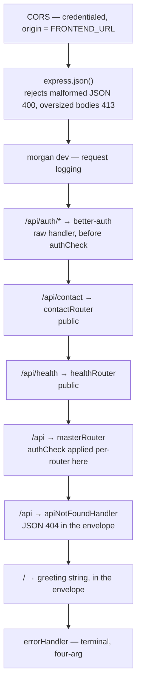

# REST API

The Nimbus API is an Express 5 application mounted under `/api`. This page covers how requests flow
through it, the conventions every endpoint follows, the authorization model, and a reference for
every route.

The realtime surface — Socket.IO — is separate and documented in [realtime.md](realtime.md). The AI
endpoints have their own page: [ai.md](ai.md).

## Contents

- [Conventions](#conventions)
- [The request pipeline](#the-request-pipeline)
- [The response envelope](#the-response-envelope)
- [Validation](#validation)
- [Authentication](#authentication)
- [Authorization and RBAC](#authorization-and-rbac)
- [Endpoint reference](#endpoint-reference)
- [Status code conventions](#status-code-conventions)
- [Design decisions and trade-offs](#design-decisions-and-trade-offs)
- [Related documentation](#related-documentation)

## Conventions

Four rules hold across the API, and knowing them makes every endpoint predictable:

1. **Routers are thin; controllers are fat.** A router extracts `req.user!.id` and params, calls one
   controller, and serializes the result. All business logic and every permission check lives in the
   controller.
2. **Every response is a `ServerResponse` envelope.** Nothing hand-rolls `res.json({...})`.
3. **Controllers return their own errors rather than throwing.** The terminal error handler is a
   backstop, not the normal path.
4. **Everything under `/api` is authenticated** — except three deliberate exceptions.

### The three public exceptions

`apps/api/src/app.ts` mounts these **above** the `/api` mount, which is where `authCheck` lives:

| Route              | Why it is public                                                   |
| ------------------ | ------------------------------------------------------------------ |
| `/api/auth/{*any}` | better-auth's own routes — you cannot require a session to sign in |
| `/api/contact`     | Used by people who have no account                                 |
| `/api/health`      | A uptime monitor has no session                                    |

Mounting them above the guarded mount keeps the master router's invariant literally true rather than
approximately true. A new router must be added to `master.router.ts` unless it is genuinely meant to
answer anonymous callers.

## The request pipeline



Read that as a stack, not a sequence: a request enters at the top and leaves at the first handler
that answers it. The three public routes sit above the `/api` mount because that is where `authCheck`
lives.

`master.router.ts` mounts six sub-routers, each with `authCheck` inline:

| Mount            | Router             |
| ---------------- | ------------------ |
| `/api/ai`        | `ai.router`        |
| `/api/workspace` | `workspace.router` |
| `/api/messages`  | `message.router`   |
| `/api/document`  | `document.router`  |
| `/api/turn`      | `turn.router`      |
| `/api/upload`    | `upload.router`    |

## The response envelope

Every endpoint returns `ServerResponse<T>` from `packages/types/src/api/serverResponse.ts`:

```ts
{ success: boolean, message: string, responseObject: T, statusCode: number }
```

Built through static factories — `ServerResponse.ok`, `.created`, `.forbidden`, and so on. Most
failure factories carry a `null` payload; the two that carry data are `ok`/`created` and
`internalError`.

Two places build the envelope with `new ServerResponse(...)` directly, because the factories are too
rigid for what they need:

- **The health 503** needs a per-dependency payload, but `serviceUnavailable()` hardcodes `null`.
- **The validation 400** needs the Zod error tree, and there is no factory for "bad request with
  detail".

That is the sanctioned escape hatch, not a precedent — if you need a payload on an error, check
whether a factory should grow a generic first.

### The terminal error handler

`error.middleware.ts` does three things worth knowing:

- **It respects `res.headersSent`** — if a response already started, it delegates to Express to close
  the connection rather than trying to write a second response.
- **It reads `err.status ?? err.statusCode`**, accepts 400–599, and defaults to 500. This is what
  routes `express.json()`'s own 400 and 413 through the envelope, so even a malformed body gets a
  consistent shape.
- **It never leaks internals.** For ≥500 it responds with a generic `"Internal Server Error"` and logs
  the real error. For 4xx it surfaces `err.message`, which is assumed deliberate.

`apiNotFoundHandler` is scoped to the `/api` mount, so unknown API paths get a JSON 404 envelope
while non-API paths keep Express's default behaviour.

## Validation

Request bodies are validated with Zod through `validate(schema)`, using schemas exported from
`packages/types/src/validations/*`. Two properties of the middleware matter:

- **It only validates `req.body`** — never params or query.
- **It does not forward the parsed value.** The parsed result is discarded, and controllers re-read
  the now-trusted `req.body`. This is stated explicitly in the middleware's module doc; it means a
  controller is responsible for the shape it reads, and a schema change is not automatically reflected
  in what a controller sees.

Failures return **400** with `z.treeifyError(...)` in `responseObject`, so the client gets
field-level detail rather than a flat message.

**Every route that accepts a body runs a schema.** That is `POST /api/workspace/create`,
`POST /api/workspace/join`, `PUT /api/workspace/role/:wsid`, `DELETE /api/workspace/leave/:wsid`,
`PUT /api/workspace/update/:wsid`, `POST /api/document/create`, `POST /api/ai/credentials`,
`PUT /api/ai/preferences` and `POST /api/contact`. The remaining routes take no body — they act on
path params alone — so there is nothing for a body schema to check.

One typing detail matters when adding validation to a route that reads params. A middleware declared
with Express's default `Request` type widens the whole handler chain's param inference to
`ParamsDictionary`, whose values are `string | string[]` — so `req.params.id` stops being a `string`
the moment `validate(...)` joins the chain. `validate` is therefore generic over the params type so
it infers from the path literal instead. Keep it that way.

## Authentication

There is a single `betterAuth` instance in `apps/api/src/lib/auth.ts`, consumed in three places:

1. **`app.all("/api/auth/{*any}", toNodeHandler(auth))`** in `app.ts` — better-auth's own routes.
2. **`authCheck.middleware.ts`** — the REST guard.
3. **`socket.middleware.ts`** — the Socket.IO handshake guard.

`authCheck` calls `auth.api.getSession({ headers: fromNodeHeaders(req.headers) })`. With a session it
sets `req.user` and continues; without one it returns **401** in the envelope. There is **no
try/catch**, so a throw from `getSession` propagates to the terminal handler and becomes a 500.

`req.user` is typed as optional in `apps/api/src/types/express.d.ts`, which is why handlers behind the
guard use `req.user!`. The non-null assertion is safe there because `authCheck` ran first.

Supported methods are email + password (with **required email verification**) and Google OAuth. Cookie
attributes are derived from `BETTER_AUTH_URL` plus an optional `AUTH_COOKIE_DOMAIN` — see
[cookieAttributes](#cookie-attributes) below.

### Cookie attributes

`apps/api/src/lib/cookieAttributes.ts` derives the session cookie's attributes rather than hardcoding
them, because the same code has to work on `http://localhost:3001` and on a cross-subdomain HTTPS
deployment.

| Base URL scheme        | Result                                                                                             |
| ---------------------- | -------------------------------------------------------------------------------------------------- |
| `https:`               | `{ sameSite: "lax", secure: true }`, plus `crossSubDomainCookies` when `AUTH_COOKIE_DOMAIN` is set |
| `http:` (or malformed) | `{ sameSite: "lax" }` only                                                                         |

The `http` branch omits `secure` deliberately: a `Secure` cookie over HTTP is one the browser simply
refuses to store, which presents as "login silently does nothing". `crossSubDomainCookies` and
`defaultCookieAttributes.domain` are mutually exclusive — setting both would conflict, so the module
sets one or the other.

The module reads no env itself; `index.ts` passes the values in and logs the resolved attributes at
boot. That log line is the only observable signal that the coupling landed where you expected.

## Authorization and RBAC

The role ladder is **`OWNER` > `ADMIN` > `MEMBER`**, defined in `MemberRole` and enforced in
`workspace.controller.ts`. `OWNER` is unique per workspace and set only at creation; new joiners
default to `MEMBER`.

| Action                 | MEMBER                                        | ADMIN                  | OWNER                  | Non-member            |
| ---------------------- | --------------------------------------------- | ---------------------- | ---------------------- | --------------------- |
| `createWorkspace`      | any authenticated user; creator becomes OWNER |                        |                        |                       |
| `getMyWorkspaces`      | own list                                      | own list               | own list               | —                     |
| `getWorkspaceBySlugId` | 200                                           | 200                    | 200                    | **404**               |
| `joinWorkspace`        | 200 unless already a member (**400**)         | same                   | same                   | **404** on a bad code |
| `regenerateInviteCode` | **403**                                       | 200                    | 200                    | **403**               |
| `updateMemberRole`     | **403**                                       | 200, with restrictions | 200, with restrictions | **403**               |
| `removeMember`         | **403**                                       | 200                    | 200                    | **403**               |
| `updateWorkspace`      | **403**                                       | 200                    | 200                    | **403**               |
| `deleteWorkspace`      | **403**                                       | **403**                | 200                    | **403**               |

### The OWNER invariants

`OWNER` is sole and immutable, and each half of that is a separate guard:

- **Nobody can promote to OWNER** — `updateMemberRole` rejects `role === "OWNER"` outright, including
  when the caller is the OWNER themselves.
- **The OWNER's role can never change** — the target's current role is checked before the update.
- **The OWNER can never be removed** — `removeMember` checks the target's role and refuses.
- **ADMINs cannot create ADMINs** — an ADMIN promoting anyone to ADMIN is rejected; only the OWNER
  can. (An ADMIN _can_ demote another ADMIN to MEMBER — only promoting is blocked.)

### 404 vs 403

Two different policies are in play, and both are deliberate:

- **`getWorkspaceBySlugId` returns a single 404** — `"Workspace not found or access denied"` — for
  both a missing workspace and a non-member. Returning 403 for the second case would confirm that the
  workspace exists, letting an outsider enumerate workspaces.
- **Document endpoints distinguish.** `getDocument` returns 404 for a missing document and 403 for a
  non-member, because document ids are cuids — unguessable, so there is nothing to enumerate.

The AI surface follows a third rule: ownership-scoped reads and deletes return **404, never 403**,
because a row that is not yours "does not exist for this caller".

## Endpoint reference

### Workspace — `/api/workspace`

| Method   | Path                       | Validated                  | Controller             | Notes                                                                                           |
| -------- | -------------------------- | -------------------------- | ---------------------- | ----------------------------------------------------------------------------------------------- |
| `POST`   | `/create`                  | ✅ `workspaceSchema`       | `createWorkspace`      | **201**. One transaction: workspace + OWNER + seeded CANVAS + seeded MARKDOWN + NimbusBot ADMIN |
| `GET`    | `/`                        | —                          | `getMyWorkspaces`      | **200**. Scoped by membership, `orderBy updatedAt desc`                                         |
| `POST`   | `/join`                    | ✅ `workspaceJoinSchema`   | `joinWorkspace`        | **404** bad code, **400** already a member. Creates membership with the default MEMBER role     |
| `PUT`    | `/regenerate-invite/:wsid` | —                          | `regenerateInviteCode` | ADMIN+. **404** missing workspace. Rotates to a new cuid                                        |
| `PUT`    | `/role/:wsid`              | ✅ `workspaceRoleSchema`   | `updateMemberRole`     | ADMIN+. **404** missing workspace or member. See the OWNER invariants                           |
| `DELETE` | `/leave/:wsid`             | ✅ `workspaceMemberSchema` | `removeMember`         | ADMIN+. **404** missing workspace or member. Refuses to remove the OWNER                        |
| `PUT`    | `/update/:wsid`            | ✅ `workspaceSchema`       | `updateWorkspace`      | ADMIN+. **404** missing, **403** non-member or MEMBER                                           |
| `DELETE` | `/delete/:wsid`            | —                          | `deleteWorkspace`      | **OWNER only**. Cascades the rows _and_ evicts live document state                              |
| `GET`    | `/:slugId`                 | —                          | `getWorkspaceBySlugId` | **400** non-integer slug, **404** missing or non-member                                         |

`GET /:slugId` is registered last so it does not shadow the literal paths above.

Workspaces are URL-routed by `slugId` (an autoincrement int) while all internal identity uses `id` (a
cuid). That split is why the DTOs carry both.

`deleteWorkspace` is the counterpart to `deleteDocument`. The schema cascades its rows, but a
database cascade does not reach the process-local Yjs and canvas maps — so it also evicts every
document the workspace held. Without that, a pending debounced save could re-persist a row the
delete just removed, and an open room would keep serving state for a document that no longer exists.

### Document — `/api/document`

| Method   | Path                      | Validated           | Controller              | Notes                                                                           |
| -------- | ------------------------- | ------------------- | ----------------------- | ------------------------------------------------------------------------------- |
| `POST`   | `/create`                 | ✅ `documentSchema` | `createDocument`        | **201**. **404** missing workspace, **403** non-member. Type defaults to CANVAS |
| `GET`    | `/workspace/:workspaceId` | —                   | `getWorkspaceDocuments` | **404** missing workspace, **403** non-member, `orderBy updatedAt desc`         |
| `GET`    | `/:docId`                 | —                   | `getDocument`           | **404** missing, **403** non-member                                             |
| `DELETE` | `/:docId`                 | —                   | `deleteDocument`        | **ADMIN/OWNER only**. Also evicts in-memory canvas and Yjs state                |

`deleteDocument` is worth noting because it does more than delete a row: it calls `evictCanvas` and
`evictDocument`, which cancel a **pending debounced save** as well as the in-memory state. Without
that, a timer scheduled before the delete would fire afterwards and re-persist a row that no longer
exists. See [document-sync.md](document-sync.md#persistence-and-eviction).

### Message — `/api/messages`

| Method | Path     | Controller             | Notes                                                    |
| ------ | -------- | ---------------------- | -------------------------------------------------------- |
| `GET`  | `/:wsid` | `getWorkspaceMessages` | **403** non-member. Latest **50**, returned oldest-first |

The query takes the 50 most recent by `createdAt desc` and then reverses them, so the client receives
a chronological window rather than having to reverse it.

### Turn — `/api/turn`

| Method | Path           | Controller           | Notes                           |
| ------ | -------------- | -------------------- | ------------------------------- |
| `GET`  | `/credentials` | `getTurnCredentials` | Time-limited coturn credentials |

Returns an `iceServers` array: two public Google STUN servers plus one TURN entry with `udp` and `tcp`
transports. Returns **500** when `TURN_SERVER_URL` is unset. See
[realtime.md](realtime.md#turn-credentials-are-minted-per-request).

### Upload — `/api/upload`

| Method | Path                | Controller           | Notes                            |
| ------ | ------------------- | -------------------- | -------------------------------- |
| `GET`  | `/avatar-signature` | `getAvatarSignature` | Cloudinary signed-upload payload |

Returns the cloud name, API key, timestamp, a **deterministic `public_id`** and a signature — never
the API secret. The deterministic id means one asset per user, so replacing an avatar overwrites
rather than accumulating orphans. The route sets `Cache-Control: no-store`, because the signed payload
is time-boxed.

### AI — `/api/ai`

| Method   | Path                       | Validated                     | Controller           |
| -------- | -------------------------- | ----------------------------- | -------------------- |
| `GET`    | `/status`                  | —                             | `getAiStatus`        |
| `GET`    | `/credentials`             | —                             | `listAiCredentials`  |
| `POST`   | `/credentials`             | ✅ `aiCredentialCreateSchema` | `upsertAiCredential` |
| `DELETE` | `/credentials/:providerId` | —                             | `deleteAiCredential` |
| `GET`    | `/preferences`             | —                             | `listAiPreferences`  |
| `PUT`    | `/preferences`             | ✅ `aiPreferenceSchema`       | `upsertAiPreference` |

Full detail in [ai.md](ai.md#the-rest-surface).

### Contact — `/api/contact` _(public)_

| Method | Path | Validated          | Controller      |
| ------ | ---- | ------------------ | --------------- |
| `POST` | `/`  | ✅ `contactSchema` | `submitContact` |

A hidden `nimbus_hp` honeypot field is the spam guard: a non-empty value returns the **same success
envelope** a real submission gets, so a bot cannot tell it was rejected. `CONTACT_TO_EMAIL` is read at
call time, not boot, so an unset value yields **503** rather than a boot failure. Downstream email
failures map to **504** on timeout and **502** otherwise.

### Health — `/api/health` _(public)_

| Method | Path | Controller  |
| ------ | ---- | ----------- |
| `GET`  | `/`  | `getHealth` |

Probes Postgres and Redis concurrently and returns `{ status: "ok" | "degraded", checks }` — **200**
when both are healthy, **503** otherwise.

The timeout mechanism is the interesting part. Both clients use `maxRetriesPerRequest: null`, so
ioredis **queues commands indefinitely** during an outage — which means `Promise.allSettled` alone is
not a timeout. Each probe is raced against a real 1500ms deadline that rejects, and Redis is
additionally short-circuited when its status is not `ready` rather than attempting a ping that will
queue. The clients are injectable, so the healthy, failed and timed-out branches are all testable
without a live stack.

## Status code conventions

| Code                | Used for                                                                |
| ------------------- | ----------------------------------------------------------------------- |
| **200**             | Success                                                                 |
| **201**             | Resource created (`POST /workspace/create`, first-time credential save) |
| **400**             | Validation failure, bad request, already-a-member, probe refusal        |
| **401**             | No session (`authCheck`)                                                |
| **403**             | Authenticated but not permitted                                         |
| **404**             | Not found — or not yours, on the AI surface                             |
| **422**             | Semantically invalid (`PUT /api/ai/preferences`)                        |
| **500**             | Unexpected server error, unconfigured TURN                              |
| **502 / 503 / 504** | Contact-form email failures; health when degraded                       |

## Design decisions and trade-offs

### Why are routers thin and controllers fat?

Because a route's information is "what path and method", and a controller's is "what may this person
do and what should happen". Splitting them the other way — logic in routers — makes permission checks
scattered across files and easy to forget on a new route. Keeping every check in one controller per
domain means the RBAC matrix above is readable from a single file.

### Why does every response share one envelope?

So a client never has to branch on shape. Without it, an error might be `{error: "..."}` from the
framework, `{message: "..."}` from a controller, and an HTML page from an unhandled path. The envelope
plus the terminal handlers means every response — including framework-generated 400s and unknown-path
404s — parses the same way.

### Why does `getWorkspaceBySlugId` return 404 instead of 403 for non-members?

Because 403 confirms the resource exists. `slugId` is a small autoincrement integer, so it is trivially
enumerable — an attacker could walk the range and use the status code as an existence oracle. A single
404 for both cases leaks nothing. Document endpoints can afford 403 because document ids are cuids.

### Why is `validate` middleware not forwarding the parsed body?

It is a deliberate simplification with a cost: controllers re-read `req.body` and rely on the schema
having run. The benefit is that the middleware has one job and no coupling to how a controller wants
its input shaped. The cost is that the type system does not connect the two — worth knowing when
changing a schema.

### Why does the health check race a timer instead of using a client timeout?

Because the clients are configured with `maxRetriesPerRequest: null`, which means they queue commands
indefinitely rather than failing them when the connection is down. A `Promise.allSettled` over those
clients would therefore hang forever during exactly the outage the endpoint exists to report. Racing
against a rejecting deadline is what turns "still pending" into "unhealthy".

### Why does the contact form return success for honeypot submissions?

Because telling a bot it was caught teaches it to adapt. Returning the identical success envelope means
a spammer cannot distinguish a filtered submission from a delivered one, so there is no signal to
tune against. The rejection is logged operator-side, where it is useful.

## Related documentation

- [architecture.md](architecture.md) — how the API fits into the two-process model.
- [ai.md](ai.md) — the AI endpoints in depth.
- [data.md](data.md) — the models these endpoints read and write.
- [realtime.md](realtime.md) — the socket surface, including `/api/turn`'s consumer.
- [testing.md](testing.md) — the HTTP integration suites, one per router.
