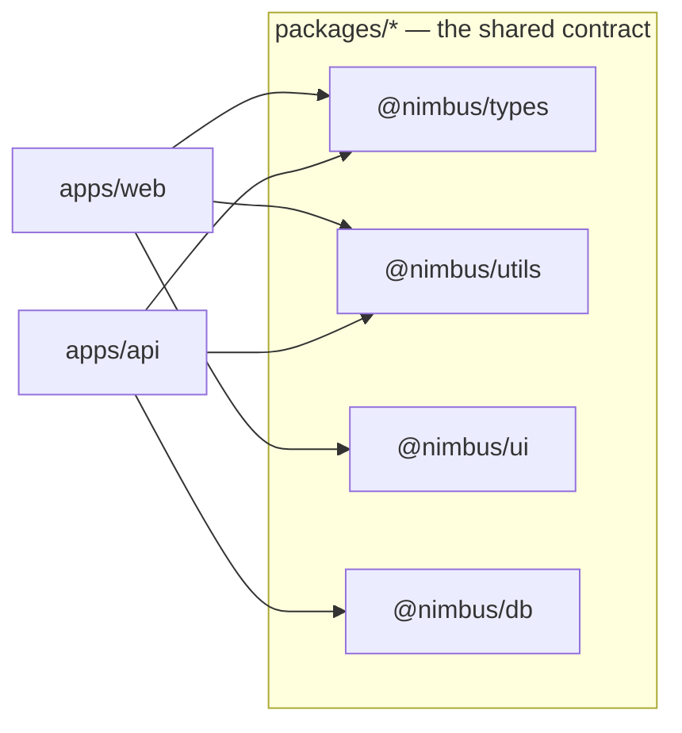
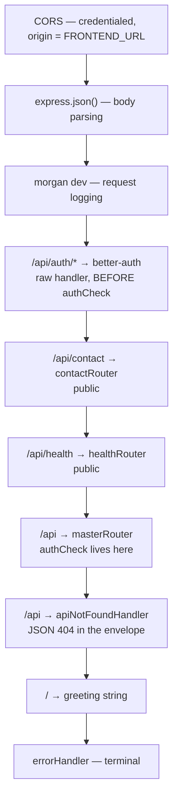
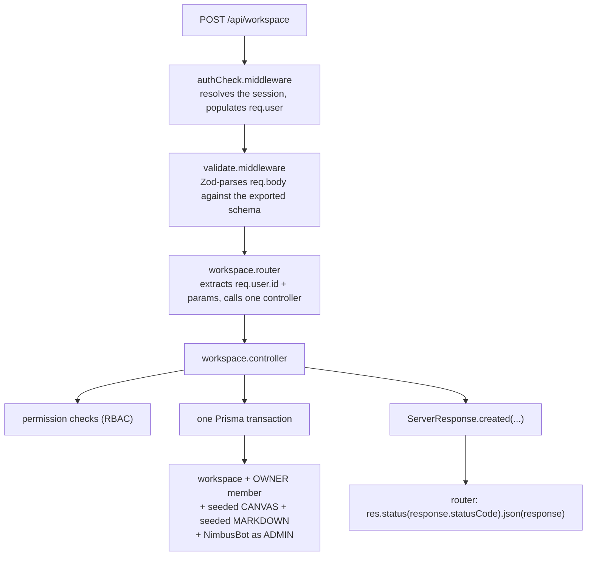
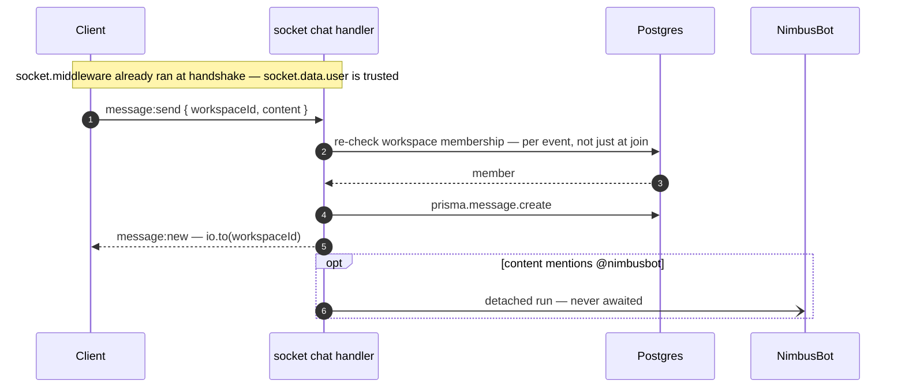

# Architecture

Nimbus is a real-time collaborative workspace — documents, whiteboards, chat, voice, and an AI
assistant — built as a Turborepo monorepo. This page is the map: the two processes it runs as, how
the packages fit together, what happens to a request from the browser to the database, and where
every kind of state actually lives.

Read this first. Every other page in `docs/` assumes the shape described here.

## Contents

- [The two processes](#the-two-processes)
- [Monorepo layout](#monorepo-layout)
- [The life of a request](#the-life-of-a-request)
- [The life of a socket event](#the-life-of-a-socket-event)
- [Where state lives](#where-state-lives)
- [Auth is the spine](#auth-is-the-spine)
- [Cross-cutting conventions](#cross-cutting-conventions)
- [Design decisions and trade-offs](#design-decisions-and-trade-offs)
- [Related documentation](#related-documentation)

## The two processes

Nimbus runs as **two separate applications**:

|                    | `apps/web`                              | `apps/api`                                            |
| ------------------ | --------------------------------------- | ----------------------------------------------------- |
| Framework          | Next.js 16 (App Router)                 | Express 5 + Socket.IO                                 |
| Port               | 3000                                    | 3001                                                  |
| Owns               | Rendering, client-side editors, routing | All persistence, auth, realtime, AI, WebRTC signaling |
| Talks to Postgres? | No                                      | Yes                                                   |
| Talks to Redis?    | No                                      | Yes                                                   |

The browser loads the web app, which renders the UI and opens a Socket.IO connection **directly to
the API** at an absolute URL (`NEXT_PUBLIC_BACKEND_URL`). There is no proxy, no rewrite, and no
Next.js `app/api` directory. The top-level `apps/web/api/` folder is a set of server-side _fetch
helpers_ that call the Express API — a naming collision worth knowing about, because it looks like
route handlers and is not.

The two share code only through `packages/*`. They share no runtime.

### Why two processes

The decision is driven by what the API has to do that a Next.js route handler cannot do well.

**Long-lived connections.** Socket.IO needs a persistent process holding open connections. Next.js
route handlers are request-scoped — they are designed to be short-lived and, under serverless or
edge deployment, may be frozen or torn down between requests. A websocket server fundamentally
needs to stay resident.

**In-memory collaboration state.** The server holds a `Y.Doc` per open Markdown document and an
element array per open canvas. That state is meaningless across a cold start, and it must be the
same instance for every participant in a room.

**Background work.** NimbusBot runs detached from the request that triggered it, so LLM latency never
delays chat delivery. That pattern needs a process that outlives the triggering request.

**Independent scaling and deployment.** The API is a Docker image on a droplet; the web app is on
Vercel. They have different scaling characteristics — the API is stateful and connection-bound, the
web app is static-ish and edge-friendly.

The cost is real: two deployments, two sets of environment variables, and CORS between them. That is
accepted in exchange for a process model that matches the workload.

## Monorepo layout

```text
nimbus/
├── apps/
│   ├── web/                    # Next.js 16 — App Router, UI, client-side Yjs    (port 3000)
│   └── api/                    # Express 5 + Socket.IO                           (port 3001)
│       └── src/
│           ├── index.ts        # bootstrap: env → boot log → listen
│           ├── app.ts          # composable factories: app, io, http server
│           ├── routers/        # thin — mount path → controller
│           ├── controllers/    # all business logic and permission checks
│           ├── middleware/     # authCheck, validate, socket handshake, errors
│           ├── socket/         # chat, document, canvas, voice, roomState
│           └── lib/            # auth, redis, presence, turn, email, ai/*
└── packages/
    ├── database/               # Prisma schema + migrations   (package name: @nimbus/db)
    ├── types/                  # socket contract, API types, Zod schemas
    ├── utils/                  # pure helpers — no I/O
    ├── ui/                     # shared React components and design system
    ├── eslint-config/          # shared lint config
    └── typescript-config/      # shared tsconfig bases
```

Two naming traps, both of which will waste your time:

- **`@nimbus/db` lives in `packages/database/`.** The package name and the directory differ.
- **`apps/web/api/` is not an API.** It is `apps/web`'s server-side fetch helpers.

### The package dependency graph



`@nimbus/types` and `@nimbus/utils` are the shared contract: the socket event types, API DTOs, Zod
validation schemas, and the pure model-selection logic. Both apps consume them, which is what keeps
the client and server honest about event names and payload shapes.

One resolution detail has bitten this repo before. `@nimbus/types` and `@nimbus/utils` expose
`exports` maps pointing at `src`, so editing them needs no rebuild — but a CommonJS `require` of
`@nimbus/types` resolves to `./dist/index.js`, which only exists after a build. The API test job does
not build it, so a `require` in server code fails in CI while passing locally against a stale `dist`,
and the failure surfaces as a generic transport error. **Use static `import`.** The trap is called
out in `apps/api/src/lib/ai/clientFactory.ts`.

`@nimbus/db` is the exception: it resolves through `dist`, because the Prisma client is generated
code that must be built. That is why `check-types` and `test` both declare a `db:generate`
dependency — see [getting-started.md](getting-started.md#turborepo-and-the-environment-contract).

## The life of a request

Take `POST /api/workspace` — creating a workspace. The Express stack is assembled in
`apps/api/src/app.ts` in a deliberate order:



Mermaid renders top-to-bottom, but read that as a stack: a request enters at the top and leaves at the
first handler that answers it. The three public routes above the `/api` mount are the deliberate
exceptions described below.

Then, for the workspace route specifically:



Three conventions are visible in that trace and hold everywhere:

- **Routers are thin, controllers are fat.** Routers extract `req.user.id` and params, call one
  controller, and serialize the result. Every permission check and every piece of business logic
  lives in the controller.
- **Every response is the `ServerResponse` envelope** — `{ success, message, responseObject,
statusCode }` — built through a static factory. Nothing hand-rolls `res.json({...})`.
- **Controllers return their own errors rather than throwing.** The terminal `errorHandler` exists as
  a backstop, not as the normal path.

The public exceptions are deliberate and structural. `/api/auth/*`, `/api/contact` and `/api/health`
are mounted in `app.ts` **above** the `/api` mount, because `authCheck` lives on that mount. That
keeps the master router's invariant — "everything under `/api` is authenticated" — literally true
rather than approximately true. A monitor has no session; a contact form is used by people who have
no account; auth endpoints must be reachable before you are authenticated.

## The life of a socket event

Sockets skip the router/controller stack entirely. `createIoServer` in `app.ts` attaches the Redis
adapter, applies the handshake authenticator, and then registers **four handler modules** per
connection:

```ts
io.on("connection", (socket) => {
  registerChatHandlers(io, socket);
  registerDocumentHandlers(io, socket);
  registerCanvasHandlers(io, socket);
  registerVoiceHandlers(io, socket);
});
```

Take a chat message:



The pattern worth preserving: **every handler re-checks workspace membership per event**, not only at
join time. A member removed mid-session loses access on their next event rather than keeping it until
they reconnect. New handlers must follow this.

The second pattern: **handlers can trust `socket.data.user` and must not re-authenticate.** The
handshake middleware already rejected unauthenticated connections before `connection` fired, so a
session lookup inside a handler is wasted work.

### Four domains, one connection

| Domain                   | Module               | State                     | Persistence                        |
| ------------------------ | -------------------- | ------------------------- | ---------------------------------- |
| Chat / presence / typing | `socket/chat.ts`     | Redis presence set        | `Message` rows                     |
| Markdown                 | `socket/document.ts` | in-memory `Y.Doc` per doc | `Document.yjsState`, 5s debounce   |
| Canvas                   | `socket/canvas.ts`   | in-memory element array   | `Document.canvasData`, 3s debounce |
| Voice                    | `socket/voice.ts`    | Redis hash roster         | none (ephemeral)                   |

Markdown and canvas are documented in full in [document-sync.md](document-sync.md). Voice and the
socket contract are in [realtime.md](realtime.md).

## Where state lives

This is the single most useful table for reasoning about the system, because "where does this live"
answers most questions about what breaks when.

| State                              | Lives in                | Survives a restart? | Survives a second replica? |
| ---------------------------------- | ----------------------- | ------------------- | -------------------------- |
| Users, workspaces, messages, docs  | Postgres                | yes                 | yes                        |
| Sessions, accounts, verification   | Postgres                | yes                 | yes                        |
| Encrypted AI credentials           | Postgres                | yes                 | yes                        |
| Presence, typing, voice rosters    | Redis                   | yes (24h TTL guard) | yes                        |
| Broadcast fan-out                  | Redis pub/sub (adapter) | n/a                 | yes                        |
| Open `Y.Doc` per markdown document | API process memory      | **no**              | **no**                     |
| Open canvas element arrays         | API process memory      | **no**              | **no**                     |
| Live socket connections            | API process memory      | **no**              | **no**                     |
| Editor content being typed         | Browser memory          | n/a                 | n/a                        |

The rows in bold are the ones that constrain deployment. Because the document and canvas maps are
**process-local**, horizontal scaling needs sticky sessions or a shared Yjs store — the Redis adapter
fans out _events_ across replicas but does not move _document state_. That failure mode is worked
through in [document-sync.md](document-sync.md#scaling).

## Auth is the spine

There is a single `betterAuth` instance in `apps/api/src/lib/auth.ts`, and it is consumed in exactly
three places. Any change to it affects all three, which is why they are listed together:

1. **Raw Express routes** at `/api/auth/{*any}` in `app.ts` — mounted before the app routers so auth
   endpoints never hit `authCheck` or Zod validation.
2. **`middleware/authCheck.middleware.ts`** — the REST guard. Populates `req.user`.
3. **`middleware/socket.middleware.ts`** — the Socket.IO handshake guard. Populates
   `socket.data.user`, registered before `io.on("connection")`.

On the client, `apps/web/lib/auth-client.ts` is the better-auth React client, and server components
read the session via `authClient.getSession(...)`. `apps/web/proxy.ts` (exported as `proxy`, not
`middleware`) is a **cookie-presence-only** route guard for `/home` and `/workspace*`. It is a UX
redirect, not a security boundary — the API re-validates every request, and the proxy cannot see
whether a cookie is valid, only that one exists.

## Cross-cutting conventions

These hold across the codebase and are worth following when adding code.

- **The socket contract is typed once.** Event names follow `namespace:verb` and live in
  `packages/types/src/socket/socketEvents.ts` as `ClientToServerEvents` / `ServerToClientEvents`.
  Both the server handlers and the typed client singleton are checked against it, so adding an event
  means adding it there first.
- **Request bodies are validated with Zod** through `validate.middleware.ts`, using schemas from
  `packages/types/src/validations/*`. The middleware does not forward the parsed value — controllers
  re-read the now-trusted `req.body`.
- **Every controller returns a `ServerResponse`.** Never hand-roll `res.json`.
- **Module headers describe purpose and constraints.** Every `.ts`/`.tsx` file opens with a
  `/** @module … */` header, and real constraints are flagged `@important`. Those notes are
  load-bearing — update them when the constraint changes, because a stale one is worse than none.
- **Tailwind CSS v4 with design tokens as CSS variables**, referenced through the v4 shorthand
  (`bg-(--background)`). There is no `@/*` path alias: intra-app imports are relative, and
  cross-package imports use `@nimbus/*`.

## Design decisions and trade-offs

### Why not put the API inside Next.js?

Because the API is stateful in ways Next.js route handlers are not designed for: long-lived
websocket connections, in-memory collaboration state that must be the same instance for every
participant in a room, and detached background work that outlives its triggering request. Splitting
also lets the two halves scale and deploy independently — the API is connection-bound and runs on a
droplet, the web app is on Vercel.

### Why does the browser talk to the API directly instead of through a proxy?

A Next.js rewrite would add a hop and, more importantly, a second place for CORS and cookie handling
to go wrong — websockets through a proxy are a common source of subtle connection failures. Pointing
the client at the API's absolute URL keeps exactly one CORS boundary, configured once in
`app.ts`, and makes the trust boundary between the two processes explicit rather than hidden behind a
rewrite.

### Why do some packages resolve through `src` and one through `dist`?

`@nimbus/types` and `@nimbus/utils` are plain TypeScript that the consuming bundlers can compile, so
they point at `src` and edits need no rebuild — a much faster loop. `@nimbus/db` cannot do that: its
Prisma client is generated code that must exist on disk before anything imports it, so it builds to
`dist`. That asymmetry is why `check-types` and `test` depend on `db:generate`.

### Why is the socket layer split into four registrar modules instead of one handler map?

Because the four domains have genuinely different state models — CRDT, last-write-wins, ephemeral
Redis rosters, and a pure signaling relay. Keeping them in separate modules makes each one readable
on its own terms and lets the document and canvas modules share `roomState.ts` explicitly rather than
by convention. The cost is four files to consult when tracing an event, which the contract in
`packages/types` makes navigable.

### Why is membership re-checked per socket event rather than once at join?

Because revocation has to be immediate. Checking only at join means a member removed from a workspace
keeps full access until they happen to reconnect — potentially indefinitely, since a socket can stay
open for days. The per-event check costs one indexed query on the events that mutate state, which is
a price worth paying for access that actually revokes.

## Related documentation

- [getting-started.md](getting-started.md) — running both processes locally, and every environment
  variable.
- [api.md](api.md) — the REST surface, auth, and RBAC in detail.
- [realtime.md](realtime.md) — the socket layer, event contract, presence and voice.
- [document-sync.md](document-sync.md) — the two collaboration models.
- [data.md](data.md) — the Prisma schema behind all persisted state.
- [frontend.md](frontend.md) — the app router structure and client state model.
- [operations.md](operations.md) — deployment, CI/CD, and security boundaries.
