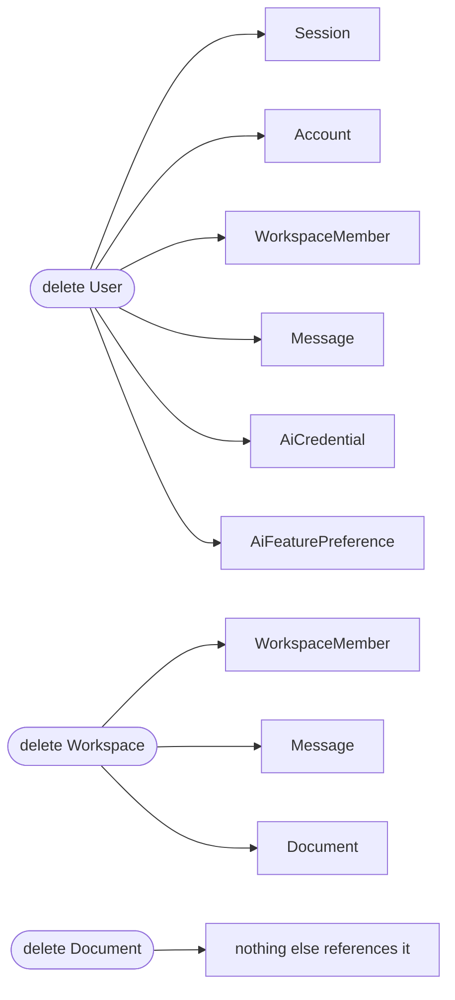

# Data Model

All persisted state in Nimbus lives in **PostgreSQL**, accessed through Prisma. This page covers the
schema, the relationships and their cascade behaviour, how migrations work, and the package that
wraps it all.

The runtime state that is _not_ in Postgres — Redis presence, in-memory Yjs docs, canvas arrays — is
mapped in [architecture.md](architecture.md#where-state-lives).

## Contents

- [The package](#the-package)
- [The models](#the-models)
- [Enums](#enums)
- [Cascades and deletion order](#cascades-and-deletion-order)
- [Migrations](#migrations)
- [Debounced persistence](#debounced-persistence)
- [The test database](#the-test-database)
- [Design decisions and trade-offs](#design-decisions-and-trade-offs)
- [Related documentation](#related-documentation)

## The package

The Prisma schema, migrations and client all live in `packages/database/`, but **the package is named
`@nimbus/db`**. Imports use the package name; the directory is `database`. That mismatch has cost
enough people enough time that it is called out in three places.

### Why it resolves through `dist`

`@nimbus/db` is the one workspace that consumers load from compiled output rather than source:

```jsonc
// packages/database/package.json
{ "name": "@nimbus/db", "main": "./dist/index.js" }
```

There is no `exports` map and no path alias, so every consumer resolves the package through its
`main` — the compiled `dist/index.js` and its declarations, not the TypeScript sources. The reason is
that the Prisma client is **generated code that must exist on disk before anything imports it**.

Two consequences follow:

- `db:generate` must run before anything type-checks or tests. This is why `check-types` and `test`
  both declare a `db:generate` dependency in `turbo.json` — see
  [getting-started.md](getting-started.md#turborepo-and-the-environment-contract).
- Editing the schema requires a regenerate, not just a save. A stale client surfaces as
  unrelated-looking type errors in files that have nothing to do with your change.

The generated client lives at `packages/database/src/generated/prisma` and is **gitignored**. A fresh
clone has no client until `prisma generate` runs, and the failure without it is
`Cannot find module './generated/prisma/client'`.

### The client singleton

`src/client.ts` builds the client with the **pg driver adapter**, not Prisma's built-in engine:

```ts
const pool = new pg.Pool({
  connectionString: connectionString ?? process.env.DATABASE_URL,
  max: 10,
  idleTimeoutMillis: 30_000,
});
return new PrismaClient({ adapter: new PrismaPg(pool) });
```

A bare `new PrismaClient()` will not work — the generator is configured for the adapter.

The singleton is cached on `globalThis` rather than in a module variable:

```ts
export const prisma: PrismaClient =
  globalForPrisma.prisma || createPrismaClient();
if (process.env.NODE_ENV !== "production") globalForPrisma.prisma = prisma;
```

The reason is Next.js hot-module reloading: a module-scoped singleton would open a new connection pool
on every reload until the database refused connections. Caching on `globalThis` survives the reload.
It is skipped in production, where there is no HMR and the module scope is already stable.

`createPrismaClient(connectionString?)` is exported separately so tests can build a client against the
test database while the app singleton points elsewhere.

## The models

Ten models: four owned by better-auth, six owned by the app.

| Model                 | Table                   | Purpose                                                  |
| --------------------- | ----------------------- | -------------------------------------------------------- |
| `User`                | `user`                  | Account record; also carries the free-tier quota counter |
| `Session`             | `session`               | One row per browser session                              |
| `Account`             | `account`               | OAuth provider link / credential record                  |
| `Verification`        | `verification`          | Email-verification and password-reset tokens             |
| `Workspace`           | `Workspace`             | Groups documents, messages and members                   |
| `WorkspaceMember`     | `WorkspaceMember`       | Join table with an RBAC role                             |
| `Message`             | `Message`               | Chat message                                             |
| `Document`            | `Document`              | A canvas or a Markdown document                          |
| `AiCredential`        | `ai_credential`         | An encrypted BYOK API key                                |
| `AiFeaturePreference` | `ai_feature_preference` | The chosen model per AI feature                          |

Note the table-naming split: better-auth's four models map to lowercase table names (`@map`), while
the app's models keep their PascalCase names. That is inherited from the better-auth adapter contract,
not a choice.

```mermaid
erDiagram
    User ||--o{ Session : "one row per browser session"
    User ||--o{ Account : "OAuth and credential links"
    User ||--o{ WorkspaceMember : "memberships"
    User ||--o{ Message : "writes"
    User ||--o{ AiCredential : "BYOK keys"
    User ||--o{ AiFeaturePreference : "chosen models"
    Workspace ||--o{ WorkspaceMember : "members"
    Workspace ||--o{ Message : "chat"
    Workspace ||--o{ Document : "documents"

    User {
        string id PK
        string email UK
        int freeDocGenerationsUsed "free-tier counter"
    }
    Session {
        string id PK
        string token UK
        datetime expiresAt
    }
    Account {
        string id PK
        string providerId
        string password "hashed; null for OAuth-only accounts"
    }
    Verification {
        string id PK
        string identifier
        datetime expiresAt
    }
    Workspace {
        string id PK "cuid — internal identity"
        int slugId UK "autoincrement — the URL identity"
        string inviteCode UK
    }
    WorkspaceMember {
        string userId FK
        string workspaceId FK
        MemberRole role "OWNER / ADMIN / MEMBER"
    }
    Message {
        string id PK
        string content
        string workspaceId FK
    }
    Document {
        string id PK
        DocumentType type
        bytes yjsState "MARKDOWN state"
        json canvasData "CANVAS state"
        string initialContent "one-shot AI seed"
    }
    AiCredential {
        string id PK
        string keyEnvelope "nimbus1.* — never plaintext"
        string maskedPreview
    }
    AiFeaturePreference {
        string id PK
        AiFeature feature
        string providerId
        string modelId
    }
```



Every relation above is `onDelete: Cascade` except `Verification`, which has no foreign key at all.
That single fact is what makes the delete behaviour in the next section true.

### User

| Field                    | Type       | Notes                                                                           |
| ------------------------ | ---------- | ------------------------------------------------------------------------------- |
| `id`                     | `String`   | `@id`. Not generated by Prisma — better-auth supplies it                        |
| `name`, `email`          | `String`   | `@@unique([email])`                                                             |
| `emailVerified`          | `Boolean`  | Defaults to `false`. Verification is required to sign in                        |
| `image`                  | `String?`  | Cloudinary URL                                                                  |
| `freeDocGenerationsUsed` | `Int`      | Defaults to `0`. The free-tier counter — see [ai.md](ai.md#the-free-tier-quota) |
| `createdAt`, `updatedAt` | `DateTime` |                                                                                 |

Relations: `sessions`, `accounts`, `workspaceMembers`, `messages`, `aiCredentials`, `aiPreferences`.

The quota counter living on `User` rather than in its own table is deliberate — it is a single
integer, read and incremented atomically, and a separate table would add a join to the hot path for
no benefit.

### Session

One row per browser session. The HTTP-only cookie references `token`.

Notable fields: `expiresAt`, `ipAddress?`, `userAgent?`, `@@unique([token])`, `@@index([userId])`.

`ipAddress` and `userAgent` are what the Active Sessions settings tab renders, parsed client-side by
`apps/web/lib/parseUserAgent.ts`.

### Account

The OAuth/credential provider link. Holds `accessToken`, `refreshToken`, `idToken` and their expiries
as nullable fields, plus `scope` and — for email/password users — the hashed `password`.

The presence or absence of a password row is what distinguishes a Google-only account from a
credential account, which is why the password-settings panel branches on `listAccounts()` rather than
on a user field.

### Verification

Email-verification and password-reset tokens: `identifier`, `value`, `expiresAt`. No relations — the
identifier is a string, not a foreign key.

### Workspace

| Field         | Type      | Notes                                                      |
| ------------- | --------- | ---------------------------------------------------------- |
| `id`          | `String`  | `@id @default(cuid())` — internal identity                 |
| `name`        | `String`  | Required                                                   |
| `description` | `String?` | Optional                                                   |
| `slugId`      | `Int`     | `@unique @default(autoincrement())` — the **URL** identity |
| `slug`        | `String`  | **Not unique**, despite the name                           |
| `inviteCode`  | `String`  | `@unique @default(cuid())`                                 |

The `id` / `slugId` split is the important one: **URLs use `slugId`** (a small integer, friendly in a
path), while every internal reference — foreign keys, socket rooms, API params — uses `id` (a cuid).
Both appear in DTOs, which is why clients carry both.

`slug` is deliberately non-unique, and there is a test pinning that. It is a display value, not an
identifier.

### WorkspaceMember

The join table carrying the RBAC role.

| Field                   | Type         | Notes                             |
| ----------------------- | ------------ | --------------------------------- |
| `userId`, `workspaceId` | `String`     | `@@unique([userId, workspaceId])` |
| `role`                  | `MemberRole` | `@default(MEMBER)`                |
| `joinedAt`              | `DateTime`   |                                   |

Both columns are individually indexed as well as uniquely paired — the unique constraint serves
lookups by the pair, and the single-column indexes serve "all members of a workspace" and "all
workspaces for a user".

Ownership lives **only here**, as `role === "OWNER"`. There is no `Workspace.ownerId`. That design
choice has a direct consequence for account deletion — see
[Cascades and deletion order](#cascades-and-deletion-order).

### Message

`content` (required), `userId`, `workspaceId`, `createdAt`, `@@index([workspaceId])`.

Messages are the source of truth; the socket broadcast is a delivery mechanism. There is no
`updatedAt`, because messages are never edited.

### Document

The most interesting model, because its columns are populated differently depending on `type`:

| Field            | Type           | Holds                                                   |
| ---------------- | -------------- | ------------------------------------------------------- |
| `id`             | `String`       | cuid                                                    |
| `title`          | `String`       | Display name                                            |
| `type`           | `DocumentType` | `@default(CANVAS)`                                      |
| `canvasData`     | `Json?`        | Full Excalidraw element array, debounce-saved every ~3s |
| `yjsState`       | `Bytes?`       | Binary Yjs state, debounce-saved every ~5s              |
| `initialContent` | `String?`      | One-shot AI-generated Markdown seed                     |
| `workspaceId`    | `String`       | `onDelete: Cascade`                                     |

The three state columns are all nullable and only one or two are ever populated for a given
document. The full lifecycle is in [document-sync.md](document-sync.md#persistence-and-eviction) and
[document-generation.md](document-generation.md#stage-5--persistence).

Two facts worth noting from the schema tests, because they are easy to get wrong:

- **`canvasData` distinguishes `[]` from `NULL`.** An empty array is a real canvas state (a canvas the
  user cleared); `NULL` means no state has ever been written. JSONB preserves that distinction.
- **`yjsState` round-trips byte-for-byte** through `bytea`, and can be cleared back to `NULL`.

### AiCredential

One row per (user, provider) — the unique constraint _is_ the deduplication rule, so re-saving a key
replaces the row rather than accumulating.

| Field            | Type        | Holds                                                                 |
| ---------------- | ----------- | --------------------------------------------------------------------- |
| `providerId`     | `String`    | Registry id                                                           |
| `label`          | `String?`   | Optional user label                                                   |
| `keyEnvelope`    | `String`    | `nimbus1.<keyId>.<ivB64>.<tagB64>.<ctB64>` — **never plaintext**      |
| `keyId`          | `String`    | `sha256(derivedKey).slice(0,8)` — which master key encrypted this row |
| `keyFingerprint` | `String`    | `sha256(apiKey).slice(0,16)` — ledger identity, not a secret          |
| `maskedPreview`  | `String`    | `"sk-…4f2a"` — safe to return over HTTP                               |
| `validatedAt`    | `DateTime?` | Stamped by the save-time probe                                        |
| `lastUsedAt`     | `DateTime?` |                                                                       |

The envelope is AAD-bound to `<userId>:<providerId>`, so a row swapped to another user or provider
fails to decrypt rather than yielding a usable key. See
[ai.md](ai.md#credential-storage) for the full scheme and its stated limits.

The plaintext key has no column. That is the point — the DTO has no field for it either, so a leak
would be a compile error rather than a code review catch.

### AiFeaturePreference

One row per (user, feature): `feature` (`AiFeature`), `providerId`, `modelId`, `updatedAt`.

There is deliberately no `createdAt` — a preference is a current choice, not a historical record, and
upserts replace it.

## Enums

| Enum           | Values                       | Notes                                                           |
| -------------- | ---------------------------- | --------------------------------------------------------------- |
| `MemberRole`   | `OWNER`, `ADMIN`, `MEMBER`   | Declaration order is the privilege order; a schema test pins it |
| `DocumentType` | `CANVAS`, `MARKDOWN`         | `CANVAS` is the default                                         |
| `AiFeature`    | `CHAT`, `MARKDOWN`, `CANVAS` | Mirrors the `AiFeature` type in `packages/types`                |

The DB enums use uppercase; the TypeScript `AiFeature` type uses lowercase. The resolver maps between
them in exactly one place, so the rest of the code never sees the difference.

`AiFeature` is duplicated from the TypeScript type into a database enum on purpose: the type is what
the application agrees on, and the enum is what the database can _enforce_. Without it, a typo in a
preference row would be a valid insert.

## Cascades and deletion order

**Every relation in the schema declares `onDelete: Cascade`.** There is no soft delete anywhere. This
is what makes deletion a small amount of application code and a large amount of database behaviour.



The application relies on this rather than cleaning up manually — the `cascade.test.ts` suite asserts
zero orphan rows precisely because nobody is checking in code.

### Account deletion has a subtlety

Ownership lives only in `WorkspaceMember.role`, so deleting a `User` cascades their membership rows —
including the ones where they were the OWNER. That would leave their workspaces orphaned with no owner
and no members.

So account deletion runs in two phases, wired through better-auth's lifecycle hooks:

1. **`beforeDelete`** — `cascadeOwnedWorkspaces(user)` finds every workspace where the user is
   `OWNER` and deletes those workspaces outright (which cascades their members, messages and
   documents). This must happen **before** the user row goes, while the membership rows still exist to
   identify them.
2. **`afterDelete`** — `destroyAvatar(user.id)`, best-effort Cloudinary cleanup.

Two details of that flow are deliberate:

- **NimbusBot is guarded.** If the user being deleted _is_ `BOT_USERID`, the cascade returns without
  deleting anything — otherwise deleting the bot account would wipe every workspace in the system.
- **`beforeDelete` is not atomic with the user deletion.** A crash between them leaves workspaces
  deleted and the account alive. The operation is idempotent, so a retry completes it, and it logs
  loudly on re-entry.

Deleting a user also removes their messages _everywhere_, because `Message.user` cascades. That is
intended: a deleted account's chat history does not linger in workspaces they did not own.

### Document deletion evicts memory too

`deleteDocument` in the controller does more than the cascade:

```ts
await prisma.document.delete({ where: { id: docId } });
evictCanvas(docId);
evictDocument(docId);
```

Those evictions cancel a **pending debounced save**. Without them, a debounce timer scheduled before
the delete would fire afterwards, find no row, and log an error — or worse, in a race, re-persist
state for a document that no longer exists.

`deleteWorkspace` does the same thing at a wider scope: it loads the workspace's document ids and
evicts each one after the cascade, because a database cascade cannot reach the process-local maps.
The two paths are deliberately symmetric — deleting a workspace is a larger delete, not a different
kind of one.

## Migrations

Nine migrations, in order. Reading them in sequence is the fastest way to understand how the
document model evolved:

| Migration                    | What it did                                                                                                 |
| ---------------------------- | ----------------------------------------------------------------------------------------------------------- |
| `init`                       | A placeholder `Test` table. No app tables                                                                   |
| `init2`                      | The better-auth tables: `user`, `session`, `account`, `verification`                                        |
| `add_workspace_schemas`      | Drops `Test`; creates `MemberRole`, `Workspace`, `WorkspaceMember`, `Message`, `Document` (with `yjsState`) |
| `add_invitation_code`        | Adds `Workspace.inviteCode` + unique index                                                                  |
| `modify_workspace_table`     | Adds `Workspace.description` and `updatedAt`                                                                |
| `migrate_from_yjs_to_canvas` | **Drops `Document.yjsState`**, adds `canvasData`                                                            |
| `add_markdown_using_yjs`     | Creates `DocumentType`; adds `type` and **re-adds `yjsState`**                                              |
| `add_initial_content`        | Adds `Document.initialContent`                                                                              |
| `add_ai_credentials`         | Creates `AiFeature`, adds `user.freeDocGenerationsUsed`, creates both AI tables, and backfills              |

The `migrate_from_yjs_to_canvas` → `add_markdown_using_yjs` pair is the interesting history: the app
first used Yjs for everything, moved to a canvas-only model, then reintroduced Yjs for Markdown
alongside the canvas. The current schema — two document types with two different state columns — is
the end state of that path, which is exactly why `DocumentType` exists and why both columns are
nullable.

Several migrations carry **data-loss warnings** in their generated SQL (dropping a column, adding a
NOT NULL column to a non-empty table). Those warnings are the reason migrations are applied with
`db:deploy` in CI and production rather than letting `migrate dev` prompt.

### The backfill is a one-way door

`add_ai_credentials` includes:

```sql
UPDATE "user" SET "freeDocGenerationsUsed" = 5 WHERE "createdAt" < TIMESTAMP '2026-09-27 06:35:26';
```

Every user who existed before the migration is marked as having **used** the full allowance; users
created after it start at 0. The intent is to grant the free tier to new users without retroactively
handing existing accounts a fresh batch of generations. It cannot be undone by re-running the
migration — the `WHERE` is a strict `<` against the boundary, and `backfill.test.ts` pins exactly
that, including that a user created at the boundary instant stays at 0.

### The workflow

```bash
npx turbo run db:generate   # regenerate the client after a schema edit
npx turbo run db:migrate    # prisma migrate dev — create + apply (local)
npx turbo run db:deploy     # prisma migrate deploy — apply only (CI/production)
```

`migration_lock.toml` pins the provider to `postgresql`. There is **no `npm run db:push`** — the tasks
live in `packages/database`, and `push` is deliberately not among them, because a schema pushed
without a migration file leaves no record and no way to reproduce the database.

## Debounced persistence

Both collaboration state columns are written on a debounce rather than per change:

| Column       | Debounce | Written by           |
| ------------ | -------- | -------------------- |
| `yjsState`   | 5s       | `socket/document.ts` |
| `canvasData` | 3s       | `socket/canvas.ts`   |

Each timer resets on every change, so a continuous editing session collapses into one write per idle
window. Both snapshot functions catch their update errors explicitly, because a document deleted
mid-session has no row to update and the timer would otherwise surface that as an unhandled rejection.

The full lifecycle — including why the debounce is safe despite the loss window, and the eviction race
that makes snapshotting subtle — is in
[document-sync.md](document-sync.md#persistence-and-eviction).

## The test database

`@nimbus/db` gets **its own database** on the same server as the API suite, and the reason is
contention.

The API suite truncates shared tables between tests. If the schema suite ran against the same
database, those truncations would wipe its fixtures mid-assertion — producing auth and foreign-key
failures that look like real bugs. So:

- `apps/api` uses **`nimbus_test`**.
- `@nimbus/db` creates and migrates **`nimbus_schema_test`** in its own `globalSetup`.

Two guards make that safe:

- **`assertThrowawayTestDatabase(url)` throws unless the URL contains `:5434`** — the test Postgres
  port. Schema tests issue `CREATE DATABASE` and `TRUNCATE`, so pointing them at a development
  database by accident would be destructive.
- **An advisory lock** (`5_123_456_789`) serialises suites that truncate, on a dedicated single-connection
  pool.

The schema suite asserts against the **deployed** database rather than the schema text alone:
`appliedSchema.test.ts` reads `information_schema`, `pg_constraint`, `pg_enum` and `pg_indexes` to
verify every table, column type, enum label order, unique index, and that all nine foreign keys are
`confdeltype = 'c'` (CASCADE). `schema.test.ts` separately guards the schema _text_ for drift. Between
them, a change that edits the schema without producing a migration is caught.

## Design decisions and trade-offs

### Why is ownership a membership role rather than `Workspace.ownerId`?

Because ownership and membership are the same relationship with a different privilege level. A separate
`ownerId` column would be a second source of truth that could disagree with the member row — and would
need to be kept in sync on transfer, on member removal, and on deletion. Keeping it in the role means
there is exactly one place to look.

The cost is real and visible: because deleting a `User` cascades their membership rows, account
deletion must delete owned workspaces in a `beforeDelete` hook while those rows still exist. That is a
genuine complication, accepted for the sake of one source of truth.

### Why cascade everything instead of soft-deleting?

Because a soft delete means every query in the application has to remember a `deletedAt IS NULL` filter,
and the one that forgets is a data-leak bug. Cascading hard deletes push the responsibility to the
database, where it is enforced by a constraint rather than by discipline. The tests assert zero orphans
precisely because the application code does not check.

### Why does the quota counter live on `User`?

Because it is one integer, updated with a single conditional statement. A separate table would add a
join and a row-lifetime question (do you keep a zero row? delete it?) for no benefit. The atomicity
that matters — the race-safe claim — comes from the conditional `UPDATE`, not from the table shape.

See [ai.md](ai.md#the-free-tier-quota) for why that claim is race-safe by construction.

### Why is the Prisma client cached on `globalThis`?

Because of Next.js hot-module reloading. A module-scoped singleton is re-evaluated on every reload,
opening a new connection pool each time until Postgres refuses connections — a failure that appears
after a few minutes of editing and looks like a database problem rather than an HMR problem. Caching on
`globalThis` survives the reload; skipping it in production keeps the behaviour explicit.

### Why does the test suite assert against the database and not just the schema file?

Because those catch different failures. A schema-text test catches an edit to `schema.prisma` that was
never migrated — the drift case. A database-catalog test catches a migration that ran but did not
produce the intended shape, which the schema text cannot see. The enum-label-order assertion is a good
example: it pins the privilege ordering that `ORDER BY role` would depend on, which is a property of
the deployed type, not of the file.

## Related documentation

- [architecture.md](architecture.md#where-state-lives) — everything that is _not_ in Postgres.
- [document-sync.md](document-sync.md) — the `Document` state columns in use.
- [ai.md](ai.md#credential-storage) — the AI credential tables and the encryption scheme.
- [document-generation.md](document-generation.md#stage-5--persistence) — how `initialContent` and
  `canvasData` are first written.
- [testing.md](testing.md#the-database-suite-gets-its-own-database) — the schema suite's setup.
