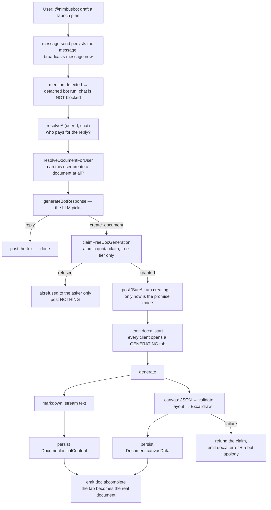
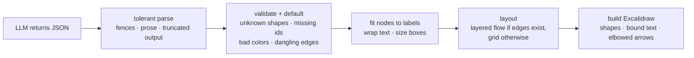

# Document Generation

You type `@nimbusbot draft a launch plan` into a workspace chat. A new tab appears, labelled with the
document's title, showing a live stream of the model thinking. A few seconds later the tab is
replaced by a real document — Markdown or an Excalidraw diagram — that anyone in the workspace can
open and edit.

This document follows that request from the mention to the persisted row, and explains why each
stage is shaped the way it is. The generation pipeline is the most decision-dense part of the
codebase: it spans chat, entitlements, quotas, two very different LLM output formats, and two
different persistence strategies.

If you are reading for the first time, [The pipeline at a glance](#the-pipeline-at-a-glance) is the
map. If you are preparing to discuss it, [Design decisions and trade-offs](#design-decisions-and-trade-offs)
collects the reasoning.

## Contents

- [The pipeline at a glance](#the-pipeline-at-a-glance)
- [Stage 1 — Mention to chat reply](#stage-1--mention-to-chat-reply)
- [Stage 2 — Entitlement resolution](#stage-2--entitlement-resolution)
- [Stage 3 — The quota claim](#stage-3--the-quota-claim)
- [Stage 4 — Generating the document](#stage-4--generating-the-document)
  - [Markdown: streaming text](#markdown-streaming-text)
  - [Canvas: JSON to geometry](#canvas-json-to-geometry)
- [Stage 5 — Persistence](#stage-5--persistence)
- [Stage 6 — Rendering on the client](#stage-6--rendering-on-the-client)
- [Failures and refusals](#failures-and-refusals)
- [Design decisions and trade-offs](#design-decisions-and-trade-offs)
- [Related documentation](#related-documentation)

## The pipeline at a glance

Everything is triggered by a chat message and orchestrated by `handleBotMention` in
`apps/api/src/socket/chat.ts`:



Two ordering rules in that diagram are load-bearing and easy to get wrong:

- **The generation runs detached** from the `message:send` handler, so LLM latency never delays the
  sender's own message appearing in the room.
- **The quota is claimed before the announcement is posted**, so the bot never promises a document
  it is not going to create.

## Stage 1 — Mention to chat reply

`apps/api/src/socket/chat.ts` handles `message:send` by persisting the message and broadcasting it
to the workspace room. Then it looks for the mention:

```ts
if (data.content.toLowerCase().includes("@nimbusbot")) {
  (async () => {
    await handleBotMention({ io, socket, userId: user.id /* … */ });
  })().catch((err) => console.error("Bot Reply Error:", err));
}
```

The immediately-invoked async function is the detachment: the handler returns without awaiting, so
the chat delivery path is complete before the first LLM call is made. The `.catch` is what keeps a
bot failure from becoming an unhandled rejection on the socket.

`generateBotResponse` in `apps/api/src/lib/bot.ts` then builds the prompt:

- **History** is the last 20 workspace messages, newest-first from the database, reversed to
  chronological. Rows whose `userId` is `BOT_USERID` become `role: "assistant"`; everyone else
  becomes `role: "user"` with their name prefixed — `Name: content` — so the model can tell speakers
  apart.
- **Instructions** frame the bot as Nimbus's companion, give it the app's own how-to facts, and
  impose strict rules (reply in plain text, no Markdown formatting, be concise).
- **One tool**, `create_document`, with a strict schema and `additionalProperties: false`.

The model's answer is parsed into a discriminated union — `BotResult`:

```ts
type BotResult =
  | { kind: "reply"; content: string }
  | { kind: "create_document"; type: "MARKDOWN" | "CANVAS"; label: string; prompt: string; chatMessage: string }
  | { kind: "refused"; … };
```

A `create_document` result carries both the arguments the user would see _and_ a `prompt` that is
the model's own detailed brief for the generator — the second model call gets a richer instruction
than the user typed.

Two properties of this module are deliberate:

- **It never throws.** LLM and database failures degrade to a fallback `reply`, so the chat handler
  upstream stays simple. The `refused` branch is not a failure — it is a successful outcome the
  caller acts on.
- **It does not decide entitlements.** The caller resolves a client handle and passes `allowDocument`;
  this module only turns that decision into a `BotResult`.

### The `allowDocument` flag

When the caller knows the user cannot create a document, it passes `allowDocument: false` and the
tool is removed from the request entirely:

```ts
const tools = allowDocument
  ? [
      /* create_document */
    ]
  : [];

if (!allowDocument) {
  instructions +=
    "\n\nDocument creation is unavailable in this conversation; answer in text.";
}
```

Both halves are needed. Removing the tool prevents the model from _calling_ it — but a model can
still say "sure, I'll create that for you" without calling anything, so the instruction line exists
to stop the verbal promise too. Without this pair, a quota-exhausted user would get a cheerful
acknowledgment and then nothing.

## Stage 2 — Entitlement resolution

`resolveAi(userId, feature)` in `apps/api/src/lib/ai/entitlements.ts` answers one question: _which
AI credential and model serve this feature for this user?_ It returns either an `AiSuccess` carrying
a ready-to-use client handle, or an `AiRefusal` with a curated message and a call-to-action.

The precedence chain is preference → credential → free tier: a per-feature model the user explicitly
picked wins; otherwise any credential they own that can serve the feature; otherwise the operator's
free tier, if configured.

Refusals are configuration states, never runtime failures — the resolver makes no network call:

| Reason                | Meaning                                                                   | CTA                |
| --------------------- | ------------------------------------------------------------------------- | ------------------ |
| `no-key`              | No credential, and either no free tier or the free tier is unusable       | Add a key          |
| `no-operator-key`     | This deployment has no free tier configured at all                        | Add a key          |
| `no-capable-model`    | Every available provider's model lacks a capability this feature requires | Manage AI settings |
| `free-tier-exhausted` | The free document allowance is spent                                      | Add a key          |

`invalid-key` and `provider-error` are deliberately _not_ in this list: they can only be known at
call time, by `clientFactory.classifyClientError`, after a request has actually failed.

### Why chat and documents resolve separately

`handleBotMention` calls the resolver twice — once for `chat`, once for `markdown`:

```ts
const chatResolution = await resolveAi(userId, "chat");
if (!chatResolution.ok) return emitRefusal(socket, "chat", chatResolution);

const documentResolution = await resolveDocumentForUser(userId);
const allowDocument = documentResolution.kind === "available";
```

These are different entitlements. A user can be perfectly able to chat while being unable to create
documents — they have exhausted their free generations, or their only credential cannot produce
diagrams. Resolving once and reusing the answer for both would either disable chat for someone who
still has it, or let documents through on an entitlement that does not cover them.

Note also `resolveDocumentForUser` returns a **`source`** — `"byok"` or `"free"` — and that field is
load-bearing:

```ts
type DocumentResolution =
  | { kind: "available"; source: "byok" | "free" }
  | { kind: "refused" /* … */ };
```

The quota is an allowance on the _operator's_ key. A user generating on their own key has already
paid for it. Dropping or defaulting `source` would silently charge a BYOK user the operator's
allowance and then refuse them once it ran out — surfacing to that user as "add an API key" when
they already have one.

There is a third resolution later, at generation time: the markdown and canvas paths each re-resolve
for their own feature, because the chat resolution may have used a different provider or model than
the user's saved preference for that document type.

## Stage 3 — The quota claim

Free-tier document generation is metered; chat replies are unlimited. The counter is
`User.freeDocGenerationsUsed`, and the limit comes from `AI_FREE_DOC_LIMIT` (default 5).

The claim in `apps/api/src/lib/ai/quota.ts` is a single conditional update:

```ts
const result = await prisma.user.updateMany({
  where: { id: userId, freeDocGenerationsUsed: { lt: limit } },
  data: { freeDocGenerationsUsed: { increment: 1 } },
});
```

This is race-safe by construction, which is the whole point. Postgres takes the row lock, a losing
concurrent request waits, and when it proceeds the `WHERE` is re-evaluated against the already-
incremented row — so it matches zero rows. `count === 0` is therefore the authoritative "exhausted"
answer.

That is why there is a separate, cheaper read for the UI. `readQuotaState` does no locking, so the
status endpoint can call it on every render, but under concurrency its value can be a generation
stale. The rule that follows from this: **a refused claim is a quota-exhausted refusal, never a UI
bug.** A read that said "1 remaining" can be beaten to that slot by another request, and the claim is
the only answer that counts.

The claim is also the gate on the announcement, and it happens in that order:

```ts
if (documentResolution.source === "free") {
  const claim = await claimFreeDocGeneration(userId);
  if (!claim.granted) {
    return emitRefusal(socket, "chat", {
      /* free-tier-exhausted */
    });
  }
  claimed = true;
}

// …only now:
const botMessage = await prisma.message.create({
  data: { content: botResult.chatMessage /* … */ },
});
```

Posting "Sure! I am creating the document for you now" before claiming would make that message a lie
whenever the claim then failed. Claiming first means the promise is only ever made once it is
funded.

**Refunds.** If generation fails _after_ a successful claim, the claim is returned:

```ts
if (claimed) {
  await refundFreeDocGeneration(userId);
  claimed = false;
}
```

This is bounded — it only returns what this call spent, gated on a `claimed` boolean in the detached
scope, and the only path that triggers it is provider-side. A user should not lose a free generation
to the model provider having a bad minute.

## Stage 4 — Generating the document

Both generators take a pre-resolved `AiClientHandle` rather than reading a module-level singleton or
`process.env`. That is the seam that makes BYOK work: the handle carries the client, the model id and
the provider's capability set, so a BYOK user's own key reaches the call site and the free tier uses
the operator's key on the configured provider — with no branch inside the generator.

Both also request their reasoning effort explicitly, via `reasoningKwargs(handle, "low")`. The
provider default is unstated and differs per provider, and — the second reason — reasoning tokens
count against the output budget, so a higher level can spend most of a reply's tokens before the
answer starts. `reasoningKwargs` is capability-aware: it returns `{}` for a model with no
`reasoning` support at all, and omits `summary` where the model rejects it, which is what keeps the
call from 400ing across providers.

### Markdown: streaming text

`apps/api/src/lib/markdownGeneration.ts` is the simpler path. A system prompt frames the model as a
technical writer with headings, lists, code blocks, tables and blockquotes, and the response streams:

```ts
for await (const event of stream) {
  if (event.type === "response.output_text.delta" && event.delta) {
    fullContent += event.delta;
    onToken(event.delta);
  }
  if (event.type === "response.reasoning_text.delta" && event.delta) {
    appendThinking(event.delta);
  }
}
```

It returns the accumulated `fullContent` — the complete document, ready to persist.

**One detail is worth noticing, because it is easy to misread.** The chat handler wires up the
callbacks like this:

```ts
const { fullContent } = await generateMarkdownDocument({
  /* … */
  onToken: () => {},
  onThinking: (token) => {
    io.to(workspaceId).emit("doc:ai:thinking", { token });
  },
  handle: mdResolution.handle,
});
```

`onToken` is a no-op. What streams to the room as `doc:ai:thinking` is the **reasoning**, not the
document body — so the overlay shows the model thinking, and the document text appears all at once
when the generation completes. The per-token hook exists on the generator (and is exercised by its
unit tests) because streaming the body is a natural future change; the current wiring deliberately
does not.

### Canvas: JSON to geometry

`apps/api/src/lib/canvasGeneration.ts` is the most involved module in the pipeline, and its design
is the one worth understanding.

The model is **not** asked for Excalidraw elements. It is asked for a small logical description:

```json
{
  "nodes": [
    {
      "id": "start",
      "shape": "rectangle",
      "label": "User visits site",
      "x": 100,
      "y": 100
    }
  ],
  "edges": [{ "from": "start", "to": "login" }]
}
```

Everything after that is deterministic application code. The path is:



**Tolerant parsing** exists because models do not reliably emit clean JSON. `extractJsonObject`
strips ```fences and brace-matches while respecting strings and escapes; if the object never closes
— a truncated stream —`trySalvageIncompleteJson`trims the dangling tail, auto-closes the brackets,
guards against mismatched closers, and re-validates with`JSON.parse` before accepting the result.

**Validation** applies safe defaults rather than rejecting: an unknown shape becomes a rectangle, a
missing id or label is generated, a bad color rotates through a soft palette, and edges that
reference missing ids, loop to themselves, or duplicate another edge are dropped.

The subtle part is node id uniqueness. The prompt asks the model for unique ids, but nothing enforces
it — and every map in the layout and element builders is keyed by id, so a repeat would leave one
node unpositioned and bind its arrows to the wrong shape. `parseDiagramRecord` therefore establishes
the invariant in one place: every original id is reserved before any alias is assigned, so an alias
can never steal a name the model actually used. A repeated id is read as _the same logical node_ —
later ones get suffixed (`node_1`, `node_1_2`), and an edge naming that id is applied to every node
that claimed it.

**Label fitting** sizes each box to its wrapped text using a character-width heuristic (~0.68em)
rather than exact measurement, because the authoritative text measurement happens client-side in
Excalidraw. Rectangles get the computed size; diamonds get +20%/+15% and ellipses +8%/+8% headroom,
because their bounds clip the corners of the text they contain. All sizes are clamped to a minimum
and maximum.

**Layout** is where the diagram becomes readable. With edges, `rankBasedLayout` runs a longest-path
layering: each node's rank is `1 + max(predecessor ranks)`, computed Bellman-Ford style so a cycle
settles instead of looping forever. Ranks become columns, each column is ordered by _barycenter_ —
the average position of its already-placed neighbours — which is the standard heuristic for reducing
edge crossings, and vertically centred against the tallest column. Ranks are compressed onto
consecutive columns first, because a cycle leaves gaps and one gap would push the whole drawing off
screen.

Without edges, a diagram has no flow to express, so `gridLayout` wraps the nodes into a √n-column
grid instead.

**Element building** emits, per node, a shape and its centre-aligned bound text (linked via
`containerId` and the shape's `boundElements`, so Excalidraw treats it as container text), then one
elbowed arrow per edge. Arrows are bound to both endpoints with normalized fixed points, and parallel
edges from the same node are fanned along the shape's edge by slot index so they do not overlap.

### Two delivery paths for the canvas

The canvas generator prefers a structured fast path and falls back to text:

1. **`output_parsed` on `response.completed`** — when the provider hands back an already-parsed
   object with a `nodes` array, it is validated and used directly.
2. **Accumulated streamed text** — `output_text.delta` events are concatenated, reconciled against
   `output_text.done` and the final `response.completed` snapshot (adopting a later value only when
   it is longer, which guards out-of-order delivery), then parsed.
3. **Last resort** — if the text does not yield valid JSON, extraction is retried over the _content
   and the reasoning log concatenated_, on the theory that the JSON bled into the reasoning channel.

The fast path is an optimisation, never the only route to an answer — the streamed text and the
structured payload are two deliveries of the same reply, so a payload that fails validation falls
through to the text rather than discarding a diagram that is already sitting there. When both fail,
the error names both failures, so a run that exhausted every route says so instead of implying the
model produced nothing.

Progress is reported through `onStatus` (`Planning diagram…` → `Parsing diagram structure…` →
`Layout — N nodes, M edges` → `Drawing shapes and connectors…` → `Done — N canvas elements`). The
chat handler currently wires `onStatus` to a no-op; only `onReasoning` is forwarded.

## Stage 5 — Persistence

This is the asymmetry that surprises people, and it is intentional.

|                     | **Markdown**                            | **Canvas**                         |
| ------------------- | --------------------------------------- | ---------------------------------- |
| Written at creation | `Document.initialContent` (String)      | `Document.canvasData` (Json)       |
| `Document.yjsState` | `null` at creation                      | not used                           |
| First `doc:join`    | seed injected into the Yjs metadata map | `canvas:state` serves `canvasData` |
| Long-term home      | `Document.yjsState` (Bytes)             | `Document.canvasData` (Json)       |

**Canvas** has a natural home for its result: `canvasData` is the element array, which is exactly
what the canvas sync layer stores anyway. The generated array is written at creation time and
`canvas:state` serves it on the next join. No handoff is needed.

**Markdown** cannot be written straight into `yjsState`, because the server does not have a Yjs
document for a document nobody has opened yet — creating one solely to persist a seed would mean
encoding Yjs state for a document with no live room. So the generated text is stored as plain
`initialContent`, and the conversion happens on the first join: the server publishes it through the
Yjs doc's metadata map, the client applies it as a template, and the column is cleared only once
that consumption is proven. The full lifecycle, including why clearing it earlier would lose
documents, is in [document-sync.md](document-sync.md#the-ai-seed-lifecycle).

Both paths create the row with a plain `prisma.document.create`, and the resulting `doc:ai:complete`
event carries the new `documentId` — so the client never has to poll or refetch to find the document
it just watched being made.

## Stage 6 — Rendering on the client

`apps/web/components/DocEditor.tsx` owns the tab strip and the AI flow. Four socket events drive it:

| Event             | Effect                                                                         |
| ----------------- | ------------------------------------------------------------------------------ |
| `doc:ai:start`    | Inserts a `GENERATING` pseudo-tab and shows `AiGenOverlay` in `starting`       |
| `doc:ai:thinking` | Appends the token to the overlay's log, moves it to `thinking`                 |
| `doc:ai:complete` | Marks `complete`, waits 500ms, then swaps the pseudo-tab for the real document |
| `doc:ai:error`    | Moves the overlay to `error` and offers **Dismiss**                            |

`AiGenOverlay` (`apps/web/components/AiGenOverlay.tsx`) renders the orb while starting or thinking, a
check on complete, and error art with a Dismiss button on failure. For a canvas it labels the log
pane _Generation log_ and shows it from the start; for Markdown it labels it _Reasoning log_ and only
shows it once tokens arrive — matching the fact that Markdown's stream is reasoning-only.

A few client-side details matter:

- **Single-flight.** `doc:ai:start` filters out any existing `GENERATING` tab before inserting the
  new one, so only one AI overlay can exist at a time. A stale generation cannot leave a phantom tab
  behind.
- **The complete handler reads the tab id from a ref, not state.** The socket callback closes over
  its registration-time values, so the ref is what carries the current generation's tab id.
- **The 500ms delay** before the swap is deliberate: it lets the check animation land rather than
  replacing the overlay the instant it finishes.
- **The generated document renders immediately.** `doc:ai:complete` for a canvas carries `canvasData`,
  so the new tab can paint its elements without waiting for a `canvas:state` round-trip.

## Failures and refusals

The distinction between a _refusal_ and a _failure_ is a design decision, not a naming choice.

| Situation                       | Event                        | Scope              | Announced in chat?            |
| ------------------------------- | ---------------------------- | ------------------ | ----------------------------- |
| No chat entitlement             | `ai:refused`                 | asking socket only | no                            |
| No document entitlement         | `ai:refused`                 | asking socket only | no                            |
| Free quota exhausted (at check) | `ai:refused`                 | asking socket only | no                            |
| Free quota exhausted (at claim) | `ai:refused`                 | asking socket only | no                            |
| Provider/model failure          | `doc:ai:error`               | whole workspace    | yes — an apology from the bot |
| Bot module internal error       | falls back to a text `reply` | —                  | yes, as an ordinary reply     |

**Refusals are personal, so they are never broadcast.** A quota exhaustion is a fact about one user;
broadcasting it would leak that fact to the room and, worse, would put a phantom `GENERATING` tab in
front of every other participant for a generation that was never going to start. The refusal goes to
the asking socket, drives `AiRefusalBanner` in that user's chat, and the room sees nothing.

**Failures are shared, so they are broadcast.** If generation started, everyone saw `doc:ai:start`
and has a `GENERATING` tab open. They all need `doc:ai:error` to resolve it, plus the bot's apology
message so the conversation reads coherently.

## Design decisions and trade-offs

### Why run the bot detached instead of awaiting it?

Because LLM latency is seconds and chat latency should be milliseconds. The sender's message must
appear in the room immediately; waiting on a model call to acknowledge a message would make the
whole chat feel broken whenever the AI is slow. The cost is that the handler no longer has a
try/catch around the bot work, which is why the detached call carries its own `.catch` and
`generateBotResponse` is written never to throw.

### Why claim the quota before posting the announcement?

Because the announcement is a user-visible promise. If the message "Sure! I am creating the document
for you now" could be posted and then followed by a failed claim, the bot would be lying in a way the
user cannot distinguish from a bug. Claiming first makes the ordering impossible to get wrong: the
promise exists only if the slot does.

### Why not charge BYOK users the free-tier quota?

The quota meters the _operator's_ spend. A user on their own key spends their own money, so charging
them the operator's allowance misreports their entitlement — and once that allowance ran out, it
would refuse a document they are entitled to, showing them "add an API key" when they already have
one. This is why `source` is carried through the resolution and checked at the claim site.

### Why remove the tool instead of refusing the call?

A model that can see `create_document` will call it, and the refusal then happens after the model has
already told the user it would help. Removing the tool means the model has no way to express the
action at all — and the extra instruction line covers the remaining hole, which is a model that
promises in prose without calling anything.

### Why one tool, with `strict: true`?

A single tool makes the model's decision binary — text answer or diagram — and keeps the parse to one
shape. `strict: true` requires `additionalProperties: false` on every object schema; the code
injects it explicitly so every provider in the registry sees the same schema, since some reject it
otherwise. A malformed tool call still falls through to a text reply rather than crashing chat.

### Why ask for logical nodes and edges instead of Excalidraw elements?

Because Excalidraw elements are a serialization format, not a description. Asking a model to emit
them means asking it to produce valid ids, version counters, seeds, binding structures and geometry —
brittle, verbose, and impossible to validate meaningfully. Asking for `{ nodes, edges }` makes the
model's job semantic ("what is connected to what") and puts geometry under deterministic application
control, where it can be tested, clamped and laid out by an algorithm rather than guessed at. This
is the single decision that makes canvas generation reliable.

### Why is the JSON parsing tolerant instead of strict?

Because a strict `JSON.parse` throws away recoverable output. Models wrap JSON in fences, add
commentary, and get truncated mid-object. The parser strips fences, brace-matches around strings and
escapes, and salvages truncated payloads by trimming and auto-closing — while still re-validating
with `JSON.parse` before accepting anything. The failure mode this prevents is a diagram that was
95% delivered being discarded because of the last 5%.

### Why refund a failed generation?

Because the failure was the provider's, not the user's. Losing one of five free generations to a
timeout is the kind of thing that makes a user distrust the quota entirely. The refund is bounded so
it cannot be farmed: it only returns what the current call claimed, and only a provider-side failure
reaches it.

### Why does generation create the document before the client can see it?

There is no optimistic local document. The server generates, persists, and then announces the id via
`doc:ai:complete`. That keeps a single source of truth for the document's existence — a client that
lost connection mid-generation will still find the document on its next fetch, because it was
persisted server-side regardless of whether that client was listening.

### Why do the streaming callbacks currently forward reasoning rather than content?

Because the overlay is a progress indicator, and reasoning is the informative part of the wait — the
document body appearing token-by-token is a nicer effect but not a more useful one. The generators
support both hooks; the wiring is a deliberate choice, and switching to streaming the body is a
one-line change on each path.

## Related documentation

- [document-sync.md](document-sync.md) — what happens to `initialContent` and `canvasData` once the
  document is opened, and how the seed is consumed.
- [ai.md](ai.md) — the provider registry, BYOK credential storage, and the entitlement system in
  full.
- [realtime.md](realtime.md) — the socket event contract these events belong to.
- [data.md](data.md) — the `Document`, `AiCredential` and `AiFeaturePreference` models.
- [testing.md](testing.md) — the suites that pin this pipeline (`bot.test.ts`,
  `canvasGeneration.test.ts`, `markdownGeneration.test.ts`, `bot.socket.test.ts`, `aiQuota.test.ts`).
