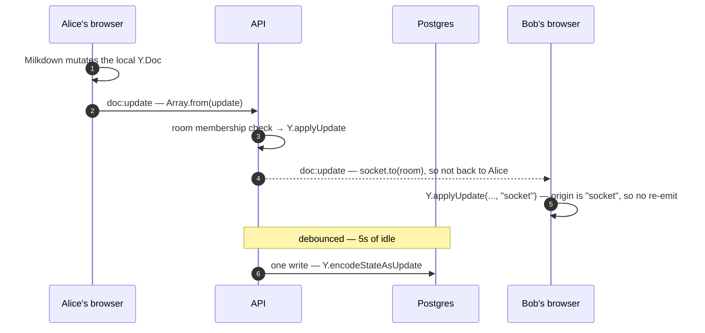
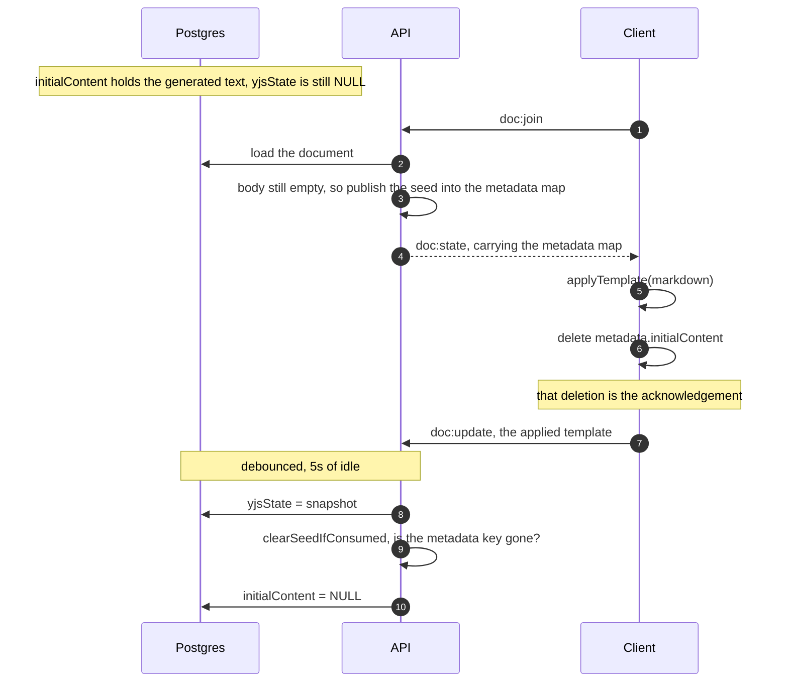

# Document Sync

Nimbus has two kinds of collaborative document, and they synchronize in two deliberately different
ways. A **Markdown** document is a true CRDT: every keystroke is merged character-by-character by
Yjs, so two people typing in the same paragraph both keep their text. A **Canvas** is full-state,
last-write-wins: the whole element array is replaced on every update, and the most recent writer
wins. This document explains why the split exists, how each side works on the server and in the
browser, and where the sharp edges are.

If you are new to the codebase, read [The two sync models](#the-two-sync-models) and then whichever
half you are touching. If you are preparing to talk about this system — in an interview, a design
review, or a PR description — [Design decisions and trade-offs](#design-decisions-and-trade-offs)
collects the reasoning behind every non-obvious choice.

## Contents

- [The two sync models](#the-two-sync-models)
- [Why two models](#why-two-models)
- [Markdown sync (CRDT)](#markdown-sync-crdt)
- [Canvas sync (last-write-wins)](#canvas-sync-last-write-wins)
- [Side-by-side comparison](#side-by-side-comparison)
- [Persistence and eviction](#persistence-and-eviction)
- [Invariants worth protecting](#invariants-worth-protecting)
- [Scaling](#scaling)
- [Design decisions and trade-offs](#design-decisions-and-trade-offs)
- [Related documentation](#related-documentation)

## The two sync models

|                 | **Markdown**                             | **Canvas**                       |
| --------------- | ---------------------------------------- | -------------------------------- |
| Document type   | `MARKDOWN`                               | `CANVAS`                         |
| Editor          | Milkdown (ProseMirror)                   | Excalidraw                       |
| Merge strategy  | CRDT — character level                   | Last-write-wins — whole array    |
| Transport       | Binary Yjs updates                       | Full element arrays              |
| Server state    | `Map<string, Y.Doc>`                     | `Map<string, CanvasState>`       |
| Database column | `Document.yjsState` (Bytes)              | `Document.canvasData` (Json)     |
| Save debounce   | 5 seconds                                | 3 seconds                        |
| Server module   | `apps/api/src/socket/document.ts`        | `apps/api/src/socket/canvas.ts`  |
| Client module   | `apps/web/components/MarkdownEditor.tsx` | `apps/web/components/Canvas.tsx` |

Both hang off the same authenticated Socket.IO connection. There is no separate websocket per
document: a socket joins one _room_ per open document, and rooms are named `doc:<id>` and
`canvas:<id>`.

## Why two models

This is the first thing to understand, because the asymmetry looks like an inconsistency until you
see the workloads.

**Text needs character-level merging.** Two people typing in the same sentence is the normal case
for a document, and a last-write-wins rule there is unusable: every keystroke from one person would
erase the other's. A CRDT (Conflict-free Replicated Data Type) represents the document as a set of
operations that can be applied in any order on any replica and still converge on the same result. Yjs
is the implementation, and it turns "two people typing at once" from a conflict into a merge.

**Diagrams do not.** Canvas elements are discrete objects — a rectangle, an arrow — that a person
moves by dragging. Two people dragging the _same_ rectangle simultaneously is rare, and when it
happens, "the last drag wins" is what a user expects anyway. Excalidraw ships its own reconciliation
for the common cases, and the element array is a natural unit to ship whole. Building a CRDT for
vector elements would be a large amount of machinery to solve a problem users do not have here.

The cost of this choice is honest and visible: **canvas edits are not merged, they are replaced.**
If two people edit a diagram at the same time, one of the two states survives and the other does not.
That is a deliberate trade, not an oversight.

## Markdown sync (CRDT)

### What Yjs actually does

A Yjs document is not "the text". It is a data structure — a `Y.Doc` — that tracks _how_ the content
came to be, so that two divergent copies can be merged without a coordinator deciding who is right.
Two operations matter here:

- `Y.encodeStateAsUpdate(doc)` — serialize the whole document to a compact binary update.
- `Y.applyUpdate(doc, update)` — apply a binary update. Applying the same update twice is a no-op,
  and applying updates in a different order than they were produced still converges.

Everything else in this half of the system is plumbing around those two functions.

### The server

`apps/api/src/socket/document.ts` owns one module-level map:

```ts
export const docs = new Map<string, Y.Doc>();
```

A document enters this map on first join, by `getDoc()` — which either returns the live instance or
hydrates one from `Document.yjsState`:

```ts
if (document.yjsState) {
  Y.applyUpdate(doc, document.yjsState);
}
```

A document leaves the map when the last participant leaves the room. In between, all edits for that
document are applied to this one instance, which is the single in-memory authority for the room.

### The three events

**`doc:join (docId)`** — the gate. It loads the document with its workspace members, refuses if the
caller is not a member, joins the room, hydrates the doc, optionally seeds AI content (see
[The AI seed lifecycle](#the-ai-seed-lifecycle)), and replies with `doc:state` — the full encoded
Yjs state as a `number[]`:

```ts
const state = Y.encodeStateAsUpdate(doc);
socket.emit("doc:state", Array.from(state));
```

Sending the _whole_ state rather than a delta is what makes a late joiner cheap: there is no
operation log to replay, and applying a full state to an already-current doc is a no-op.

**`doc:update (docId, update)`** — the edit. Three things happen, in order:

```ts
if (!socket.rooms.has(DOC_ROOM(docId))) {
  return socket.emit("doc:error", "Not joined to document");
}

const doc = docs.get(docId) ?? (await getDoc(docId));
Y.applyUpdate(doc, Uint8Array.from(update));
socket.to(DOC_ROOM(docId)).emit("doc:update", update);
debouncedSave(docId);
```

The first check is the interesting one. It does **not** re-query workspace membership — it checks
that the socket is in the room, because only a socket that passed the `doc:join` membership gate can
be in the room. That turns a database query per keystroke into an in-memory set lookup, while still
refusing a stray authenticated socket that knows a document id but never joined. `canvas:update`
guards identically, and the two are kept in step on purpose.

**`doc:leave (docId)`** — the exit. It leaves the room, and if the room is now empty, snapshots and
evicts. The emptiness check is repeated _after_ the awaited snapshot; see
[The eviction race](#the-eviction-race).

### Data flow



The room check and the `"socket"` origin are the two guards in that flow. The first is what stops a
socket that never joined from writing; the second is what stops two clients bouncing the same update
forever.

The `origin` argument is the echo guard. Local mutations carry no origin; remote ones are applied
with the literal origin `"socket"`, and the listener only forwards updates whose origin is not
`"socket"`. Without this, two clients would bounce the same update back and forth forever.

### The AI seed lifecycle

When NimbusBot generates a Markdown document it writes the text to `Document.initialContent` rather
than to `yjsState` (see [document-generation.md](document-generation.md#stage-5--persistence)).
That column is a **one-shot seed**, and getting it wrong loses documents, so the handoff is explicit:



The client's deletion of the metadata key is the whole mechanism: it is what makes "the template was
applied" an observable fact rather than an assumption.

On `doc:join`, if the document is `MARKDOWN`, has `initialContent`, and its Yjs body is still empty,
the server publishes the text through the shared doc's metadata map:

```ts
if (doc.getXmlFragment("prosemirror").length === 0) {
  doc.getMap("metadata").set("initialContent", document.initialContent);
  seededDocs.add(docId);
}
```

The client applies it as a template and then **deletes the key from the map** — that deletion is the
acknowledgment:

```ts
const initialMarkdown = metadata.get("initialContent") as string | undefined;
if (initialMarkdown) metadata.delete("initialContent");
connectCollab(initialMarkdown);
```

The column itself is cleared only after a snapshot proves the client consumed the seed.
`clearSeedIfConsumed` runs after each save and nulls `initialContent` only when the metadata key is
gone:

```ts
if (!seededDocs.has(docId)) return;
if (doc.getMap("metadata").has("initialContent")) return; // not consumed yet

seededDocs.delete(docId);
await prisma.document.update({
  where: { id: docId },
  data: { initialContent: null },
});
```

Clearing the column at join time instead would open a window: a client that unmounts before applying
the template would leave a document with no `initialContent` and no `yjsState` — an empty document,
permanently. The second branch of the join closes the opposite case: if the body is already
non-empty, the seed reached Yjs on an earlier attempt, so the column is redundant and is dropped
immediately.

### The client

`MarkdownEditor.tsx` wraps Milkdown with the `@milkdown/plugin-collab` binding. Four mechanics are
worth knowing.

**The editor is read-only until the collaboration binding is live.** This is not a nicety. Binding
renders the Y.Doc _into_ the view and replaces whatever the view held — so an editor that accepted
keystrokes before binding would silently discard them, because those keystrokes never became a Yjs
update and therefore nothing persisted them. The lock is applied at view construction:

```ts
ctx.set(editorViewOptionsCtx, { editable: () => false });
```

and released only after `connect()`, which is the call that renders the doc:

```ts
collabService.bindDoc(doc);
collabService.setAwareness(awareness);
if (initialMarkdown) collabService.applyTemplate(initialMarkdown);
collabService.connect();

ctx.get(editorViewCtx).setProps({ editable: undefined });
```

Clearing the option rather than setting `true` hands the decision back to the collab plugin, which
disables editing on its own while it renders a snapshot.

**The join is retried, not assumed.** `socket.on("connect")` re-emits `doc:join`, so a reconnect —
which hands the server a brand-new socket with no rooms — re-enters the room. A 2-second timer
re-emits `doc:join` if no `doc:state` arrived at all, because silently binding an empty doc would
look exactly like data loss to the user.

**The session effect does not depend on `useEditor().get`.** That accessor is a fresh closure on
every render, so using it as a dependency would tear down and rebuild the Y.Doc, the awareness
instance and the socket room on every render of the editor subtree. It lives in a ref instead.

**Cleanup re-locks before unbinding**, so there is never a moment where the view is editable with
nothing left to sync it.

## Canvas sync (last-write-wins)

### The server

`apps/api/src/socket/canvas.ts` mirrors the document module almost line for line, with one
structural difference: it stores the element array itself, not a CRDT.

```ts
type CanvasState = readonly OrderedExcalidrawElement[];
export const canvases = new Map<string, CanvasState>();
```

`canvas:join` membership-gates exactly as `doc:join` does, then replies with the full state:

```ts
socket.emit("canvas:state", { documentId: canvasId, elements });
```

`canvas:update` replaces the room's state wholesale and relays it:

```ts
if (!socket.rooms.has(CANVAS_ROOM(documentId))) {
  return socket.emit("canvas:error", "Not joined to canvas");
}

if (elements.length === 0 && initialized !== true) {
  return;
}

canvases.set(documentId, elements);
socket
  .to(CANVAS_ROOM(documentId))
  .emit("canvas:update", { documentId, elements });
debouncedSave(documentId);
```

### The empty-array guard

The middle check is the one piece of canvas logic that is not obvious, and it is the most common
source of "why did my canvas get wiped" bugs in systems like this.

An empty array means two completely different things depending on when it arrives:

1. **"I have not loaded the authoritative state yet."** A freshly-mounted Excalidraw instance starts
   empty and fires `onChange` with `[]` before `canvas:state` arrives. Broadcasting that would erase
   every other participant's work.
2. **"I deliberately deleted everything."** A loaded client selecting all and pressing delete
   legitimately sends `[]`.

The array cannot distinguish them — both are `[]`. So the client sends an explicit flag,
`initialized: true`, once it has applied the authoritative state, and the server keys the guard off
the flag rather than the length. A loaded client sending `[]` really did clear the canvas and is
allowed through; an unloaded one is dropped.

Note that this is deliberately _not_ the "empty array is dropped when non-empty state exists" rule
alone — that rule alone would make an intentional clear impossible to express.

### The client

`Canvas.tsx` has to solve a related problem on the other side: Excalidraw renders local edits
immediately, even if the component drops their emission. So an editable board during the join
window would show strokes that the incoming `canvas:state` then silently erases.

The fix is the same shape as the editor lock: the board is read-only until the authoritative state
lands, via `viewModeEnabled={!isReady}`, and `isReady` is only set inside the `canvas:state`
handler.

Two independent guards keep updates from looping:

```ts
const REMOTE_GUARD_MS = 200; // how long a remote updateScene is assumed to drive onChange
const EMIT_DEBOUNCE_MS = 300; // local-edit debounce before emitting
```

`onChange` returns early if `isRemoteUpdate.current` is set (this change came from a remote
`updateScene`, so forwarding it would echo) or if the board is not initialized. Otherwise it
debounces 300ms and emits the latest elements with `initialized: true` — so a burst of drags
collapses into one emit, and the payload is always the newest array rather than an interpolation of
intermediate ones.

One detail matters on teardown: a pending debounce is **flushed** rather than dropped, so the last
300ms of strokes do not die with a tab switch.

React memoization is load-bearing in a less obvious place too. `initialData` is memoized on
`documentId` alone:

```ts
const initialData = useMemo(
  () => ({ elements: [...initialElements] }),
  [documentId],
);
```

Excalidraw consumes `initialData` once per mount, so re-seeding it after mount would do nothing —
and the parent remounts the component per document via `key`, which is why the dependency is the
document id and not the elements.

## Side-by-side comparison

| Question                         | Markdown                         | Canvas                              |
| -------------------------------- | -------------------------------- | ----------------------------------- |
| What is stored server-side?      | A `Y.Doc`                        | An element array                    |
| What crosses the wire?           | Binary Yjs update, as `number[]` | The full elements array             |
| What happens on concurrent edit? | Both merge                       | One wins                            |
| What is sent on join?            | `doc:state` — full encoded state | `canvas:state` — full elements      |
| Save debounce                    | 5s                               | 3s                                  |
| Client unlock trigger            | after `collabService.connect()`  | on `canvas:state`                   |
| Client echo guard                | `origin !== "socket"`            | `isRemoteUpdate` ref + 200ms window |
| Empty-state guard                | not applicable (CRDT)            | `initialized` flag required         |

## Persistence and eviction

Both modules persist on the same pattern: **debounce while active, snapshot on the way out.**

```ts
const debouncedSave = (docId: string) => {
  if (saveTimers.has(docId)) clearTimeout(saveTimers.get(docId)!);
  const timer = setTimeout(() => {
    saveSnapshot(docId);
    saveTimers.delete(docId);
  }, 5000); // 3000 in canvas.ts
  saveTimers.set(docId, timer);
};
```

Why debounce: a person typing produces many Yjs updates per second, and a canvas drag produces a
stream of `onChange` calls. Writing each one to Postgres would be a self-inflicted load test. The
timer resets on every update, so a continuous editing session collapses into one write per idle
window. The trade-off is a bounded window of unsaved work — see
[Design decisions and trade-offs](#design-decisions-and-trade-offs).

Eviction is deliberately not just "delete from the map when someone leaves":

```ts
if (isRoomEmpty(io, room, socket)) {
  await saveSnapshot(docId);

  if (isRoomEmpty(io, room, socket)) {
    evictDocument(docId);
  }
}
```

### The eviction race

The emptiness check is repeated after the `await`, and the reason is a real bug class rather than
defensive habit.

Between the first check and the snapshot completing, a user can rejoin. That rejoin re-registers the
socket in the room and calls `getDoc`, which finds the still-present doc — so it does not re-hydrate.
If the leaver then evicted on the strength of the _first_ check, the map entry would be deleted out
from under a live socket. The rejoin's socket is in the room, so its updates pass the membership
check, but `docs.get(docId)` returns nothing — and every subsequent update is dropped silently. The
document appears to stop syncing with no error anywhere.

Eviction also clears the pending debounce timer, which is why it is the only sanctioned way to remove
an entry:

```ts
export const evictDocument = (docId: string) => {
  const timer = saveTimers.get(docId);
  if (timer) {
    clearTimeout(timer);
    saveTimers.delete(docId);
  }
  docs.delete(docId);
  seededDocs.delete(docId);
};
```

Clearing the timer matters for deletion: a document deleted from the database with a debounce still
pending would have its snapshot re-persist a row that no longer exists. Both `saveSnapshot` functions
catch that case explicitly, since the timer would otherwise surface it as an unhandled rejection.

`isRoomEmpty` lives in `apps/api/src/socket/roomState.ts` and is shared by both modules precisely so
they cannot drift. It discounts the departing socket, because `disconnecting` fires while the socket
is still listed in its own rooms:

```ts
const sockets = io.sockets.adapter.rooms.get(room);
if (!sockets || sockets.size === 0) return true;
return sockets.size === 1 && sockets.has(socket.id);
```

Both modules use `disconnecting` rather than `disconnect` for teardown, because rooms are still
intact at that point — which is the only window in which the code can tell _which_ rooms to leave.

## Invariants worth protecting

These are the rules the code depends on. Breaking one produces silent data loss rather than an
error, which is why each is marked `@important` at the top of its module.

1. **`docs` and `canvases` are process-local.** Horizontal scaling needs a shared Yjs/state store or
   sticky sessions. See [Scaling](#scaling).
2. **Eviction must re-check room membership after any awaited snapshot.** Otherwise a rejoin during
   the await is stranded without a doc.
3. **`evictDocument` / `evictCanvas` are the only sanctioned way to remove an entry** — they clear
   the pending debounce as well.
4. **`doc:update` and `canvas:update` require room membership**, not a fresh membership query. Both
   modules must guard identically.
5. **`initialContent` is cleared only after the client consumes the seed**, never at join time.
6. **The canvas empty-array guard keys off `initialized`, not array length.** Removing it makes an
   unloaded client wipe the room; keying it off length makes an intentional clear impossible.
7. **The editor and the canvas are read-only until their state has landed.** Both would otherwise
   accept edits that are then silently overwritten or discarded.
8. **The client must not forward updates whose origin is `"socket"`**, or two peers echo forever.

## Scaling

The Redis adapter in `apps/api/src/index.ts` fans out Socket.IO broadcasts across replicas, so a
message sent to one instance reaches clients connected to another. **Document and canvas state does
not follow.** Each process holds its own `docs` and `canvases` maps, so with two replicas:

- Alice (replica A) and Bob (replica B) both open the same document.
- Alice's update is applied to A's `Y.Doc` and broadcast — Bob receives it and merges it locally,
  so _live_ collaboration still appears to work.
- But B has its own `Y.Doc` for that document, hydrated separately. The two snapshots diverge, and
  whichever replica saves last wins in `yjsState`.
- A user who joins on replica B sees B's snapshot, which may be missing A's edits.

Fixing this properly means one of:

- **Sticky sessions** — route a document's participants to the same replica. Cheapest, and it
  preserves the current design, but it constrains the load balancer and breaks on replica failure.
- **A shared store** — move `Y.Doc` state into Redis (or a dedicated Yjs persistence layer) so any
  replica can serve any document. Correct, and the direction a production deployment would take.

The same caveat applies to the canvas map. It is not a small change, which is why it is documented
here and flagged in the module headers rather than silently relied upon.

## Design decisions and trade-offs

The questions below are the ones this subsystem invites. Each answer is a real decision in the code,
with its cost stated.

### Why CRDT for text but last-write-wins for canvas?

Because the failure modes are different. Concurrent typing is the _normal_ case for a document, so
character-level merging is a requirement. Concurrent dragging of the same shape is _rare_ for a
diagram, and when it happens "the last drag wins" is an acceptable and even expected outcome.
Applying a CRDT to canvas elements would be significant machinery to solve a problem that does not
meaningfully occur.

The cost is real and worth stating plainly: simultaneous canvas edits are not merged — one state is
discarded.

### Why is the whole state sent on join instead of replaying operations?

A late joiner needs the current document, not its history. `doc:state` is a single
`encodeStateAsUpdate` payload, and applying it to a doc that is already current is a no-op — so the
same message works for a first join, a rejoin after a reconnect, and a redundant retry. There is no
operation log to store, prune, or bound.

### Why does `doc:update` check room membership instead of querying the database?

It is a query per keystroke versus a set lookup. Membership was already proven at `doc:join`, and
only a socket that passed that gate is in the room, so the room check is exactly as strong for this
purpose. The same reasoning applies to `canvas:update`.

### Why debounce saves instead of writing every update?

A continuous editing session would otherwise be thousands of `UPDATE` statements per minute per
document. The 5s (text) and 3s (canvas) windows collapse a burst into one write. The cost is a
bounded loss window: a hard process crash can lose up to one debounce interval of the most recent
edits. Clean exits are covered — `doc:leave` and `disconnecting` snapshot before evicting — and the
full state also exists in every connected client's memory, so a lost window is recoverable from a
participant rather than gone outright.

The two intervals differ (5s vs 3s) because they were tuned separately for their own write patterns;
they are independent constants, not derived from one another.

### Why is the seed cleared on consumption rather than at join time?

Because clearing at join time can destroy a document. If the column were nulled the moment it was
published to the metadata map, a client that unmounted before applying the template would leave
behind a document with no seed and no Yjs body — empty, and unrecoverable. Tying the clear to an
explicit acknowledgment (the client deleting the metadata key) means the column survives until the
content demonstrably exists somewhere durable.

### Why is the editor read-only until bound?

Because the binding _replaces_ the view's content. Keystrokes accepted before that render do not
become Yjs updates, so nothing persists them — the user watches their typing disappear, and a reload
shows an empty document. The wait is one round-trip, imperceptible locally and seconds against a
remote database, which is exactly why it cannot be left to timing.

### Why does the canvas need an `initialized` flag rather than a length check?

Because `[]` is ambiguous — "not loaded yet" and "I deleted everything" are the same value. The flag
carries the intent the array cannot, which is the only way to protect a joining client's peers from
being wiped _and_ let a loaded client clear the board on purpose.

### Why re-check room emptiness after the snapshot?

Because an await is a window. A rejoin landing inside it re-registers the room, and evicting on the
strength of the pre-await check would leave a live socket holding a room membership but no doc —
after which every update from that socket is dropped silently. This is the class of bug that
produces "sync just stopped working" reports with nothing in the logs.

## Related documentation

- [document-generation.md](document-generation.md) — how `initialContent` and `canvasData` come to
  exist in the first place.
- [realtime.md](realtime.md) — the socket layer, event contract, and scaling model in full.
- [data.md](data.md) — the `Document` model and the migration history behind these columns.
- [testing.md](testing.md) — the API socket suites (`document.socket.test.ts`,
  `canvas.socket.test.ts`, `yjs.convergence.test.ts`) that pin this behaviour.
