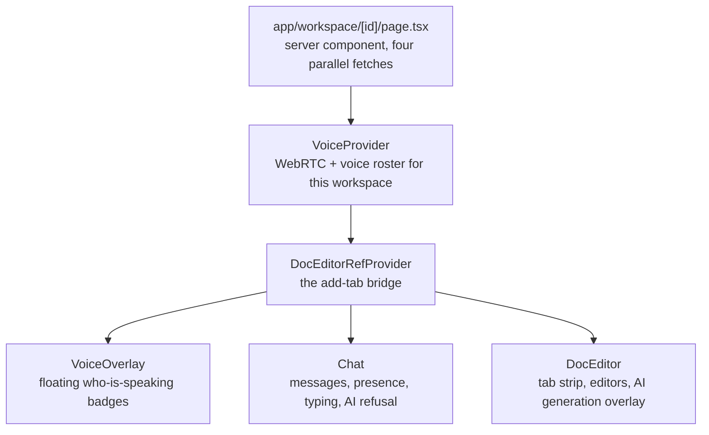

# Frontend

`apps/web` is a Next.js 16 App Router application. This page covers the route structure, the state
model, how the socket and the editors are wired, the component inventory, and the styling system.

The most important thing to know up front: **there is no state management library.** No Redux,
Zustand, Jotai, MobX, Valtio or Recoil — and no React Query or SWR either. State is `useState`, React
Context for cross-tree sharing, refs for mutable live objects, and server components for data that
comes from the API. [The state model](#the-state-model) explains why, and what each mechanism is for.

## Contents

- [Route map](#route-map)
- [Server and client components](#server-and-client-components)
- [The route guard](#the-route-guard)
- [The state model](#the-state-model)
- [The socket](#the-socket)
- [The editor ref bridge](#the-editor-ref-bridge)
- [Hooks](#hooks)
- [Components](#components)
- [Styling](#styling)
- [The shared UI package](#the-shared-ui-package)
- [Design decisions and trade-offs](#design-decisions-and-trade-offs)
- [Related documentation](#related-documentation)

## Route map

```text
app/
├── layout.tsx              root — fonts, globals.css, SocketProvider, Analytics, SEO metadata
├── page.tsx                /                     public marketing landing page
├── login/page.tsx          /login                auth shell (login ↔ signup ↔ forgot)
├── email-verified/         /email-verified       static confirmation card
├── reset-password/         /reset-password       reads ?token=, redirects to /login without it
├── contact/page.tsx        /contact              public contact form (prefills from session if any)
├── home/
│   ├── page.tsx            /home                 authenticated dashboard: workspace grid
│   └── loading.tsx                               skeleton grid
├── settings/page.tsx       /settings             account settings (5 tabs)
└── workspace/[id]/
    ├── page.tsx            /workspace/:slugId    the workspace room
    ├── loading.tsx                               two-pane skeleton
    └── not-found.tsx                             "Workspace Not Found"
```

There is no `app/api/` directory — the browser calls the Express API directly. There is also no
`app/error.tsx`; errors surface through the `error.tsx`-less default and through inline component
state.

`/settings` and `/home` are both guarded by the proxy below. `/contact` is deliberately in neither the
protected nor the public list, so it is reachable signed in or out.

### The workspace room

`app/workspace/[id]/page.tsx` is the densest page. It fetches in parallel — `getWorkspace`,
`getMessages`, `getDocuments`, `getAiStatus` — and composes three nested providers:



Note the parameter naming: the route segment is `[id]` but the value is a **`slugId`** — the
autoincrement integer, not the cuid. Internal identity uses cuids; URLs use `slugId`. See
[data.md](data.md#workspace).

## Server and client components

Pages are server components. Everything interactive is `"use client"`.

| Server component                     | Why                                            |
| ------------------------------------ | ---------------------------------------------- |
| `layout.tsx`                         | Fonts, metadata, one provider mount            |
| `page.tsx` (landing)                 | Static marketing, no interactivity             |
| `home/page.tsx`                      | Fetches the session and workspaces server-side |
| `settings/page.tsx`                  | Fetches `getAiStatus()` to seed the panel      |
| `workspace/[id]/page.tsx`            | The four parallel fetches above                |
| `contact`, `login`, `reset-password` | Read session/params, delegate to a client form |

| Client component                                           | Why                               |
| ---------------------------------------------------------- | --------------------------------- |
| `DocEditor`, `Canvas`, `MarkdownEditor`                    | Socket lifecycle, Yjs, Excalidraw |
| `Chat`, `TypingIndicator`, `VoiceControls`, `VoiceOverlay` | Socket events and WebRTC          |
| `AccountSettings`, `AiSettingsPanel`, `ApiKeyDialog`       | Forms and dialogs                 |
| `FormSwitch`, `LoginForm`, `SignupForm`, `ContactForm`, …  | React Hook Form                   |
| `UserNavbar`, `ViewWorkspaces`, `WorkspaceSettings`        | Interactive shells                |

`MarkdownEditor.tsx` has no explicit `"use client"` directive but imports Milkdown, which is
client-only — so it is effectively client-side and must be rendered from a client boundary.

## The route guard

`apps/web/proxy.ts` exports `proxy` — Next 16's renamed middleware entry point, deliberately not
called `middleware`:

```ts
const protectedRoutes = ["/home", "/workspace", "/settings"]; // prefix match
const publicRoutes = ["/login", "/", "/email-verified", "/reset-password"]; // exact match
```

- A protected path with no session cookie → redirect to `/login`.
- A public path with a session cookie → redirect to `/home`.

The matcher excludes `api`, `_next/static`, `_next/image` and `.png` requests.

**This is a UX redirect, not a security boundary.** The session is read with `getSessionCookie` and
is **never verified** — the guard cannot tell a valid cookie from an expired or forged one. Every API
request re-validates the session server-side, and the socket handshake authenticates independently.
The proxy exists so a signed-out user does not see a flash of a dashboard before being bounced.

## The state model

Four mechanisms, each for a specific job.

### `useState` — local component state

The default. Examples: `ViewWorkspaces`' filter toggle, `Chat`'s message list and composer value,
`DocEditor`'s tabs and active index, `VoiceOverlay`'s active speakers, and most hooks' loading/error
state.

`DocEditor` is worth noting: it keeps `{ tabs, active }` as **one** state object rather than two.
Opening, closing, replacing or reordering a tab all change which index should be selected, so separate
states would force one setter to be called from inside the other's updater — and React requires
updaters to be pure and double-invokes them under StrictMode, so that pattern either fires the
selection change twice or drops it.

### React Context — cross-tree sharing

Two contexts, and only two:

- **`VoiceProvider`** wraps `useVoiceChat` once per workspace and publishes the result. Voice state is
  needed by `VoiceControls` (in the chat header) and `VoiceOverlay` (a sibling), which have no
  ancestor-descendant relationship.
- **`DocEditorRefProvider`** — the ref bridge, described below.

Notably, the **socket is not a context**. See [The socket](#the-socket).

### `useRef` — mutable live objects

Refs hold things that must not trigger a re-render, or that must survive one. Examples:

- `useVoiceChat`: the local media stream, the peer-connection map, audio elements, analyser nodes,
  pending ICE candidates, the animation frame handle — plus `isMutedRef`-style mirrors of state that
  socket callbacks need to read.
- `Canvas`: the Excalidraw imperative API, the remote-update flag, the initialized flag, the latest
  elements, the debounce timer.
- `DocEditor`: `aiGeneratingRef`, because the `doc:ai:complete` handler closes over its
  registration-time values and needs the _current_ generation's tab id.
- `MarkdownEditor`: the editor accessor, because `useEditor().get` is a fresh closure on every render.

### Server components — server state

Data that comes from the API is fetched in a server component and passed down as props. There is no
client cache. Mutations that change server state call `router.refresh()` (or, in a few places,
`window.location.reload()`) to re-run the server render.

That is a deliberate trade: no cache-invalidation logic to get wrong, at the cost of a full server
round-trip on mutation. For an app whose live updates arrive over the socket anyway, the refresh is
mostly about structural changes — a workspace renamed, a member removed — which are rare.

## The socket

`apps/web/lib/socket.ts` exports a **module-level singleton**, not a context:

```ts
export const socket: Socket<ServerToClientEvents, ClientToServerEvents> = io(
  URL,
  {
    withCredentials: true,
    autoConnect: false,
  },
);
```

Three properties are load-bearing:

- **`autoConnect: false`** — importing the module does not open a connection. Only `SocketProvider`
  calls `connect()`.
- **`withCredentials: true`** — the session cookie rides the handshake, which is how the server
  authenticates the connection.
- **Typed with both event maps** from `@nimbus/types`, so `socket.emit` and `socket.on` are checked
  against the contract. A typo in an event name is a compile error, not a silent no-op.

`providers/socketProvider.tsx` owns the lifecycle and is mounted **once** in the root layout:

```tsx
useEffect(() => {
  if (!socket.connected) socket.connect();
  socket.on("connect_error", handler);
  return () => {
    socket.off("connect_error", handler);
    socket.disconnect();
  };
}, []);
```

Note what it does _not_ do: it provides no context value. Consumers import the `socket` singleton
directly. The provider exists solely to own connect/disconnect, so the connection lifetime is tied to
the app rather than to whichever component happened to mount first.

Each consumer registers its own listeners in its own effect and removes them on cleanup — for example
`Canvas` listens for `canvas:state`, `canvas:update`, `connect` and `canvas:error`, and `MarkdownEditor`
listens for the `doc:*` equivalents. Components that need to **rejoin a room after a reconnect** listen
for the generic `connect` event and re-emit their join, because a reconnect hands the server a
brand-new socket with no rooms.

This is why the socket is a singleton rather than a context: the reconnect-rejoin logic lives in each
feature component, and it needs the same socket instance that the other components are using.

## The editor ref bridge

`DocEditorRefContext.tsx` solves a specific layout problem. `DocEditor` owns the tab list, but
components _outside_ it need to open a tab: the AI flow in `Chat` discovers a newly generated document,
and `WorkspaceSettings` opens a document you just created.

Prop drilling would route through the workspace page and back down. Instead the context holds a
**ref** to the callback:

```tsx
const addTabRef = useRef<AddTabFn | null>(null);
```

`DocEditor` writes its `addTab` into `addTabRef.current` in an effect; siblings call
`addTabRef.current(doc)`.

A ref rather than state is the point: the callback's identity changes on re-render, and publishing a
new value would re-render every consumer each time. A mutable ref gives consumers a stable handle that
always calls the current function. The effect that assigns it also clears it on unmount, so a stale
closure cannot outlive the editor.

## Hooks

23 hooks in `apps/web/hooks/`. Three families:

### Form hooks — React Hook Form + Zod

The largest group. Each pairs `useForm` with `zodResolver` and a schema from `@nimbus/types`, then
calls `fetch` directly against `${NEXT_PUBLIC_BACKEND_URL}/api/...` with `credentials: "include"`.

`useWorkspaceForm`, `useWorkspaceJoinForm`, `useWorkspaceDocumentForm`,
`useUpdateWorkspaceSettingsForm`, `useAddApiKeyForm`, `useContactForm`, `useProfileForm`,
`useChangePasswordForm`, `useDeleteAccount`, `useSignupForm`, `useLoginForm`,
`useForgotPasswordForm`, `useResetPasswordForm`.

The schemas being shared with the API is what keeps client-side and server-side validation in step —
the same `workspaceSchema` gates the form and the `POST /api/workspace/create` route.

Two details are worth copying:

- **`useContactForm` deliberately omits `credentials: "include"`** — the contact endpoint is public and
  there is no reason to send a session cookie to it.
- **`useAddApiKeyForm` performs no network call.** It owns the form state and hands the values to a
  caller-supplied `save`, so the dialog can be reused by both "add" and "replace" without duplicating
  the request logic. It clears the plaintext key on success.

### Auth hooks — better-auth client

`useLoginForm`, `useSignupForm`, `useForgotPasswordForm`, `useResetPasswordForm`, `useProfileForm`,
`useChangePasswordForm`, `useDeleteAccount`, `useActiveSessions`, `useAvatarUpload`.

These call `authClient` rather than the REST API, because better-auth owns those flows. Two handle
genuine edge cases:

- **`useChangePasswordForm`** probes `listAccounts()` and returns a discriminated state — `with-password`
  renders the change form, `google-only` renders a "send me a set-password link" button. A Google-only
  user has no current password to type, so showing them the form would be a dead end.
- **`useDeleteAccount`** does the same probe to decide whether password re-auth is required, and
  handles the `SESSION_EXPIRED` case by signing out and routing to login rather than showing an error
  the user cannot act on.

### Socket and WebRTC hooks

- **`useTypingIndicator`** — socket events plus timers. Throttles outbound `typing:start` to 2s,
  stops after 3s idle, expires inbound indicators after 5s, and filters out your own events by
  `currentUserId`.
- **`useVoiceChat`** — the largest hook. Fetches `/api/turn/credentials`, acquires the mic **muted**,
  maintains a mesh of `RTCPeerConnection`s, relays offer/answer/ICE over the socket, plays remote audio
  through hidden elements, and runs an `AnalyserNode` loop on `requestAnimationFrame` to detect who is
  speaking.

There is **no toast library**. Confirmations and failures are inline banners, rendered state, or — in a
few of the older workspace hooks — `alert()`. That inconsistency is real; the newer surfaces use state.

## Components

25 components in `apps/web/components/`, grouped by domain.

**Auth** — `FormSwitch` (owns the login/signup/forgot crossfade _and_ both form hooks, so state
survives switching), `LoginForm`, `SignupForm`, `ForgotPasswordForm`, `ResetPasswordForm`,
`ContactForm`.

**Workspace** — `UserNavbar`, `ViewWorkspaces` (All/Mine filter over a masonry grid),
`CreateWorkspaceCard` (create and join flows), `WorkspaceSettings` (the largest component: General,
Members, Documents, Permissions tabs).

**Editors** — `DocEditor` (tab strip, AI flow, generates the `GENERATING` pseudo-tab), `Canvas`
(Excalidraw, full-state sync), `MarkdownEditor` (Milkdown + Yjs), `AiGenOverlay`, `DocEditorRefContext`.

**Chat** — `Chat`, `TypingIndicator`, `AiRefusalBanner`.

**Voice** — `VoiceControls` (mute/deafen, avatar group), `VoiceOverlay` (floating speaking badges).

**AI** — `AiSettingsPanel`, `AiModelPicker`, `ApiKeyDialog`.

**Settings** — `AccountSettings` (Profile, Password, Sessions, AI, Danger Zone).

Two structural notes:

- `LoginForm` and `SignupForm` carry no `"use client"` directive themselves — they are presentational
  and receive hook results from `FormSwitch`, which is the client boundary.
- `SettingTabs` **unmounts inactive panels** rather than hiding them. Callers rely on this, so a tab's
  state resets when you navigate away — which is why the AI panel refetches on mount.

## Styling

Tailwind CSS v4, with design tokens as CSS custom properties.

### Tokens

The token definitions live in `packages/ui/src/globals.css` under a single `:root` block, in OKLCH:

```text
--background  --foreground  --card  --popover  --primary  --secondary
--muted  --accent  --destructive  --border  --input  --ring
--chart-1 … --chart-5
--sidebar  --sidebar-foreground  --sidebar-primary  --sidebar-accent  --sidebar-border  --sidebar-ring
```

Each has a `-foreground` companion where it needs one.

### Dark only

The theme is **dark-only**. The token file says so explicitly — light-mode overrides are intentionally
not defined — and there is no `dark:` variant usage, no `prefers-color-scheme` query, no `data-theme`
attribute, and no `next-themes`. Excalidraw is hardcoded `theme="dark"` to match.

This is worth knowing before adding a component: there is no light variant to test against, and no
toggle to break.

### The `bg-(--token)` shorthand

Components reference tokens through Tailwind v4's CSS-variable shorthand:

```tsx
<div className="bg-(--background) text-(--foreground) border-(--border)" />
```

That is equivalent to `bg-[var(--background)]` but reads as a first-class utility. It composes with
opacity and gradients too — `bg-(--primary)/25`, `shadow-(--primary)/20`,
`bg-linear-to-br from-(--primary) to-(--sidebar-primary)`.

### How the pieces load

```css
/* apps/web/app/globals.css */
@import "tailwindcss";
@config "../tailwind.config.ts";
@import "@nimbus/ui/globals.css";
```

The JS config is loaded through the `@config` directive and is intentionally minimal — a `content`
glob set and the shared `@nimbus/ui/tailwind.config` preset. **The design tokens are CSS-first**, in
`:root`, not in the JS theme. So adding a color means adding a custom property, not editing config.

`apps/web/app/globals.css` also defines the animation utilities (`animate-fade-in`,
`animate-slide-up`, `animate-checkmark`, `animate-orb-explode`, …), effect classes (`.glass-card`,
`.text-gradient`, `.bg-grid`, `.scrollbar-thin`) and an extensive set of `.milkdown` editor overrides.

### No path alias

There is no `@/*` alias. Intra-app imports are **relative** (`../lib/socket`, `./Canvas`), and
cross-package imports use the workspace names (`@nimbus/ui/Button`, `@nimbus/types`). Relative imports
in a deep tree are more verbose than an alias would be; matching the existing convention matters more
than the preference.

## The shared UI package

`packages/ui` holds the design system. Its export map is per-file, not a barrel:

```jsonc
{
  "./*": "./src/components/*.tsx",
  "./icons/*": "./src/components/icons/*.tsx",
  "./utils/*": "./src/utils/*.ts",
  "./globals.css": "./src/globals.css",
  "./tailwind.config": "./tailwind.config.ts",
}
```

So `@nimbus/ui/Button` resolves to `src/components/Button.tsx` — no barrel file, which means importing
one component does not pull in every other one.

Components include `Button`, `Input`, `Textarea`, `Avatar`, `AvatarGroup`, `Skeleton`, `Navbar`,
`OptionsMenu`, `WorkspaceCard`, `SettingTabs`, `DocTabs`, `Select`, `ToggleGroup`, `AlertDialog`,
`VerifyEmailDialog`, `OrContinueWith`, `ChatMsgA`/`ChatMsgB`, `AiGenOrb`, and roughly 30 icons.

`packages/ui` is consumed as **source**, not as a build artifact — the `content` glob in
`apps/web/tailwind.config.ts` includes `../../packages/ui/src/**/*.{ts,tsx}`, so Tailwind scans the
package's source directly.

## Design decisions and trade-offs

### Why is there no state management library?

Because the app's shared state falls into two categories that a store would not help with. Live
collaboration state lives in Yjs and Excalidraw, which have their own propagation and must not be
duplicated into a store. Server data lives on the server, and server components fetch it. What remains
— a filter toggle, a tab index, a modal's open state — is genuinely local.

Adding Zustand would mean a second source of truth for state that is already correctly owned
elsewhere, plus the question of how to keep the store in sync with the socket. The two contexts that do
exist each solve a specific cross-tree problem that props could not.

### Why is the socket a module singleton instead of a context?

Because its lifecycle is app-scoped, not tree-scoped — `SocketProvider` connects once and the
connection outlives every component. Putting it in context would add a provider lookup to every
consumer for no benefit, and would suggest the instance could vary by subtree, which it must not.

The reconnect-rejoin logic reinforces this: `Canvas` and `MarkdownEditor` each listen for `connect` and
re-emit their join. They need the _same_ socket the other components use, and a singleton guarantees
that.

### Why does `DocEditorRefContext` use a ref instead of state?

Because the value is a callback whose identity changes on every render. Publishing it as state would
re-render every consumer whenever `DocEditor` re-renders — including on unrelated changes like a
streaming AI token. A mutable ref gives consumers a stable handle that always invokes the current
function, which is exactly the semantics needed and costs no renders.

### Why are pages server components if the app is so interactive?

Because the interactivity is concentrated. The heavy client work is in the editors, chat and voice —
a handful of components. Everything above them (routing, session checks, initial data) is a natural
server component, which means the API token never reaches the browser, the initial render is populated
rather than empty, and the client bundle excludes the data-fetching layer entirely.

### Why is the theme dark-only?

A light theme means a second set of tokens, a toggle, a persistence mechanism, and — most expensively —
a second visual state to verify for every component. For a product at this stage the second theme is
cost without a user. Keeping it dark-only means one set of tokens with one set of contrast decisions,
and it is stated explicitly in the token file so nobody hunts for the light overrides.

### Why does `SettingTabs` unmount inactive panels?

Because it makes each panel's lifecycle simple: mount means "fetch what I need", unmount means
"discard it". A hidden-but-mounted panel would keep stale data and open subscriptions for tabs the user
is not looking at. The cost is a refetch on every tab switch, which is the right trade for settings
panels that are visited rarely and change server state when used.

## Related documentation

- [architecture.md](architecture.md) — the two-process model and where state lives.
- [realtime.md](realtime.md) — the socket contract these components consume.
- [document-sync.md](document-sync.md) — the editor internals.
- [ai.md](ai.md) — the AI settings panel and its endpoints.
- [testing.md](testing.md) — the web suite's `node` and `happy-dom` projects.
