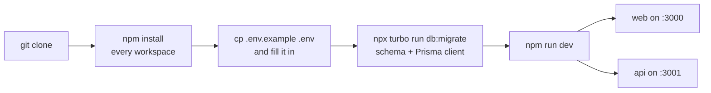

# Getting Started

This page takes you from a fresh clone to both processes running locally, and explains the
configuration and tooling you will interact with daily. [README.md](../README.md) has the short
version; this is the long one.

If something here does not work, [Troubleshooting](#troubleshooting) lists the failures that
actually happen, and [architecture.md](architecture.md) explains the two-process structure that
makes some of them non-obvious.

The path, in order:



## Contents

- [Prerequisites](#prerequisites)
- [Install](#install)
- [Environment configuration](#environment-configuration)
- [Database setup](#database-setup)
- [Running the app](#running-the-app)
- [Common commands](#common-commands)
- [Turborepo and the environment contract](#turborepo-and-the-environment-contract)
- [Redis TLS is derived, not assumed](#redis-tls-is-derived-not-assumed)
- [Code conventions](#code-conventions)
- [Contributing workflow](#contributing-workflow)
- [Troubleshooting](#troubleshooting)
- [Related documentation](#related-documentation)

## Prerequisites

| Requirement    | Notes                                                                                                                                       |
| -------------- | ------------------------------------------------------------------------------------------------------------------------------------------- |
| **Node.js 20** | CI and the production Docker image both run Node 20. The root `engines` field allows `>=18`, but 20 is what everything is verified against. |
| **npm 11**     | The repo pins `packageManager: npm@11.5.2`.                                                                                                 |
| **Docker**     | Only needed for the test stack and for running Postgres/Redis locally.                                                                      |
| **Git**        | —                                                                                                                                           |

You do **not** need to install Postgres or Redis directly — `docker-compose.test.yml` provides both,
and many people point their development `.env` at the same containers.

## Install

```bash
git clone https://github.com/tejasnasa/nimbus.git
cd nimbus
npm install
```

`npm install` at the root installs every workspace, because this is an npm-workspaces monorepo
orchestrated by Turborepo.

## Environment configuration

```bash
cp .env.example .env
```

`.env.example` is the authoritative list — it documents every variable the API reads, splits
required from optional, and explains the ones with non-obvious behaviour. The API validates this file
at boot.

### What happens if you get it wrong

`apps/api/src/lib/env.ts` parses the environment once at startup and **fails the process, naming
every missing variable**:

```text
Invalid environment configuration:
  - REDIS_URL: Required
  - TURN_SECRET: Required
Set the missing values (see .env.example) and restart. Refusing to start rather than
serving with the affected features broken.
```

That last sentence is the design intent. The alternative — booting successfully and failing per
request — turns a configuration mistake into a mystery 500 an hour later, or worse, into a feature
that is silently dead.

One subtlety: the module validates **at boot**, but call sites still read `process.env` at call time.
So a value changed after boot (which is exactly what the test suites do) takes effect. `env` is a
startup gate, not a cached config object.

### Required variables

Grouped by what breaks without them:

| Group              | Variables                                                              |
| ------------------ | ---------------------------------------------------------------------- |
| **Data stores**    | `DATABASE_URL`, `REDIS_URL`                                            |
| **Auth**           | `BETTER_AUTH_SECRET`, `BETTER_AUTH_URL`, `FRONTEND_URL`                |
| **NimbusBot**      | `BOT_USERID`                                                           |
| **Voice**          | `TURN_SECRET`                                                          |
| **Email**          | `RESEND_API_KEY`                                                       |
| **Google OAuth**   | `GOOGLE_CLIENT_ID`, `GOOGLE_CLIENT_SECRET`                             |
| **Avatar storage** | `CLOUDINARY_CLOUD_NAME`, `CLOUDINARY_API_KEY`, `CLOUDINARY_API_SECRET` |
| **AI credentials** | `AI_CREDENTIAL_ENCRYPTION_KEY` (min 32 chars)                          |

Two are worth calling out:

- **`BOT_USERID` must reference a row that actually exists.** Workspace creation inserts NimbusBot as
  an ADMIN member, so the foreign key rolls back the entire creation transaction if the user row is
  missing. Bot message persistence and history role-mapping also degrade without it.
- **`AI_CREDENTIAL_ENCRYPTION_KEY` has no default and no degraded mode.** There is deliberately no
  "BYOK off" runtime state — a missing or short key is a boot failure rather than an unconfigured
  path. Use `openssl rand -base64 32`.

### Defaulted and optional variables

| Variable                                | Default          | Notes                                                                                    |
| --------------------------------------- | ---------------- | ---------------------------------------------------------------------------------------- |
| `NODE_ENV`                              | `development`    | `development` \| `test` \| `production`                                                  |
| `AI_PROVIDER`                           | `deepseek`       | The operator free tier's provider                                                        |
| `AI_MODEL`                              | `deepseek-flash` | The operator free tier's model                                                           |
| `AI_FREE_DOC_LIMIT`                     | `5`              | Free document generations per user                                                       |
| `AI_API_KEY`                            | _(unset)_        | Unset **disables the free tier** rather than crashing — a BYOK-only deployment sets none |
| `AI_CREDENTIAL_ENCRYPTION_KEY_PREVIOUS` | _(unset)_        | Decrypt-only, for key rotation                                                           |
| `TURN_SERVER_URL`, `TURNS_SERVER_URL`   | _(unset)_        | Required at runtime by `/api/turn`, optional at boot                                     |
| `AUTH_COOKIE_DOMAIN`                    | _(unset)_        | Cross-subdomain cookie scope                                                             |
| `EXTERNAL_IP`                           | _(unset)_        | Read by the coturn compose service, not by the app                                       |
| `CONTACT_TO_EMAIL`                      | _(empty)_        | Recipient for contact-form submissions                                                   |

### The client needs its own variables

`apps/web` reads `NEXT_PUBLIC_BACKEND_URL` (the API's absolute URL) and `NEXT_PUBLIC_BOT_USERID`.
Note that **process env wins over `apps/web/.env`** — which is what lets the E2E suite point the web
app at a local API even though the committed `.env` points at the deployed one.

## Database setup

```bash
npx turbo run db:migrate
```

That runs `prisma migrate dev`, which creates and applies the schema and regenerates the Prisma
client. For a production or CI database, use the deploy variant instead:

```bash
npx turbo run db:deploy
```

Note that there is **no `npm run db:push`**, despite what an older README or habit might suggest.
The Prisma tasks live in `packages/database`, and the turbo task names are `db:generate`,
`db:migrate` and `db:deploy`.

## Running the app

```bash
npm run dev        # turbo: both processes together
```

- Web: **http://localhost:3000**
- API: **http://localhost:3001**

Or run one workspace directly for a narrower loop:

```bash
npm run dev -w apps/api     # nodemon + tsx watch on src/index.ts
npm run dev -w apps/web     # next dev --port 3000
```

`turbo`'s `dev` task declares `dependsOn: ["^db:generate"]`, so the Prisma client is regenerated
before the API starts. This matters: a stale client surfaces as unrelated-looking type errors rather
than as a Prisma problem.

### First useful things to try

1. Sign up at `/` — email verification is required, so check the Resend-delivered mail (or the API
   logs in local development).
2. Create a workspace from the home dashboard. This seeds one canvas, one Markdown document, and
   NimbusBot as an ADMIN.
3. Open two browser profiles on the same workspace, open the same Markdown document in both, and
   type — that is the Yjs CRDT at work.
4. Type `@nimbusbot draft a project brief` in chat. You will need either an operator `AI_API_KEY` or
   your own key added under **Settings → AI**.

## Common commands

| Command                     | What it does                          |
| --------------------------- | ------------------------------------- |
| `npm run dev`               | Both processes (API :3001, web :3000) |
| `npm run build`             | `turbo run build`                     |
| `npm run lint`              | `turbo run lint`                      |
| `npm run check-types`       | `turbo run check-types`               |
| `npm run format`            | Prettier across `**/*.{ts,tsx,md}`    |
| `npm test`                  | Every workspace's suite               |
| `npm run test:coverage`     | The same, with coverage               |
| `npx turbo run db:generate` | Regenerate the Prisma client          |
| `npx turbo run db:migrate`  | Create and apply a migration          |

The `Makefile` wraps the test workflow — `make help` lists everything:

```bash
make test-infra-up          # test Postgres (5434) + Redis (6381)
make test-schema            # apply migrations to the test DB
make test                   # every suite, turbo cache bypassed
make test-suite SUITE=smoke # one API shard
make test-coverage-check    # coverage, then the ratchet
```

[testing.md](testing.md) covers the suites themselves.

## Turborepo and the environment contract

This is the single most common source of "works locally, fails in CI" confusion, so it is worth
understanding even on day one.

**Turbo runs tasks in strict env mode.** A task receives _only_ the variables named in its own `env`
or `passThroughEnv` list; everything else is filtered out of the child process. A script can
therefore pass locally for no better reason than _you_ having the variable exported, and fail in CI
with no error message of its own.

From `turbo.json`:

| Task            | Env passed through                        |
| --------------- | ----------------------------------------- |
| `db:generate`   | `DATABASE_URL`, `NEXT_PUBLIC_BACKEND_URL` |
| `db:migrate`    | `DATABASE_URL`, `NEXT_PUBLIC_BACKEND_URL` |
| `db:deploy`     | `DATABASE_URL`                            |
| `test`          | `DATABASE_URL`, `REDIS_URL`, `NODE_ENV`   |
| `test:coverage` | `DATABASE_URL`, `REDIS_URL`, `NODE_ENV`   |

The concrete failure this prevents: `prisma migrate deploy` in CI received no `DATABASE_URL` at all,
masked locally by `packages/database/.env`, which CI does not have. **Adding a new variable that a
task reads means adding it here too**, or that task silently sees nothing.

The second half of the contract is the `db:generate` dependency:

```jsonc
"test": { "dependsOn": ["^db:generate", "db:generate"] }
```

The caret means _dependencies'_ generate, which is what `apps/api` needs. The bare entry generates
the client for the package under test. Drop the bare one and `@nimbus/db`'s own tests fail on a fresh
checkout with `Cannot find module './generated/prisma/client'` — that client is generated and
gitignored.

## Redis TLS is derived, not assumed

`apps/api/src/lib/redis.ts` decides TLS from the connection string rather than trusting the scheme
alone:

- `rediss://` always negotiates TLS.
- A `redis://` URL is decided by its **host**: loopback, a private range, or a dot-free service name
  (`redis`) stays plaintext; anything addressed by an FQDN gets TLS.

This is deliberate, and the reason is that the failure mode is silent. A deployment configured
`redis://` against a managed host that only speaks TLS does not error loudly — the handshake never
completes, ioredis emits no `error` event, and the client simply never becomes ready. The API looks
healthy while every realtime feature is dead. A connect watchdog logs that case after 10 seconds.

`REDIS_TLS=true|false` overrides the derivation for a host it gets wrong.

## Code conventions

The codebase was annotated in a dedicated pass, and that style is the house convention:

- **Every `.ts`/`.tsx` file opens with a `/** @module … @description … \*/` header\*\* describing its
  purpose, architectural role, and critical constraints.
- **Real constraints are flagged `@important`.** These are load-bearing. If the constraint changes,
  update the note — a stale `@important` is worse than none, because it teaches the wrong lesson with
  authority.
- **TSDoc docstrings on all exports**, with `@param` and `@returns`.
- **Inline comments only on complex or non-obvious logic.** No comments on straightforward CRUD or
  self-explanatory state. Where a comment does exist, it usually explains _why_, not _what_.
- **Prisma models and enums carry `///` doc comments.**

Frontend-specific conventions:

- **Tailwind CSS v4** with design tokens as CSS variables, referenced through the v4 shorthand —
  `bg-(--background)` rather than a hex value or a config lookup.
- **No `@/*` path alias.** Intra-app imports are relative; cross-package imports use `@nimbus/*`.

## Contributing workflow

1. Branch from `main` (`git checkout -b feature/your-feature`).
2. Make your change, then run `npm run check-types` and `npm run lint` before pushing.
3. Add tests if you touched behaviour — the coverage floor is a ratchet, and new branches are the
   usual way a passing change breaks it. See [testing.md](testing.md#coverage).
4. Open a PR against `main`. CI runs lint/typecheck, the API suite, the web suite and the package
   suites; E2E is nightly only.
5. [CONTRIBUTING.md](../CONTRIBUTING.md) has the code of conduct and PR expectations.

**Do not lower a `.coverage-floor` to make a build pass.** Raise it in the same change that adds the
coverage.

## Troubleshooting

**`Cannot find module './generated/prisma/client'`** — the Prisma client was never generated.
Run `npx turbo run db:generate`, or `npx turbo run build --filter=@nimbus/db`.

**Type errors that make no sense, mentioning Prisma types** — usually the same cause. A stale
generated client produces errors in files that have nothing to do with your change.

**A script works locally but sees no environment variables in CI** — turbo's strict env filtering.
Add the variable to that task's `passThroughEnv` in `turbo.json`.

**The API boots but realtime features do nothing** — check the Redis connection. TLS derivation is
the usual culprit; look for the 10-second connect watchdog log line.

**`prisma migrate deploy` fails in CI with a missing `DATABASE_URL`** — `passThroughEnv` again.

**Port already in use** — 3000/3001 for the app, 5434/6381 for the test stack. The test ports are
deliberately offset from the sibling Illume project's 5433/6380 so the two can run at once.

**Two test suites wiping each other's fixtures** — the API suite and `@nimbus/db` use _different_
databases on the same server (`nimbus_test` and `nimbus_schema_test`) precisely so that the API
suite's per-test `TRUNCATE` cannot wipe the schema suite mid-assertion. If you see auth or foreign-key
failures that make no sense, check whether something is running against the wrong database.

## Related documentation

- [architecture.md](architecture.md) — the two-process model and where state lives.
- [testing.md](testing.md) — suites, fixtures, coverage ratchet and CI.
- [operations.md](operations.md) — deployment, CI/CD pipelines and security boundaries.
- [data.md](data.md) — the schema and migration workflow.
- [api.md](api.md) — the REST surface you will be calling.
