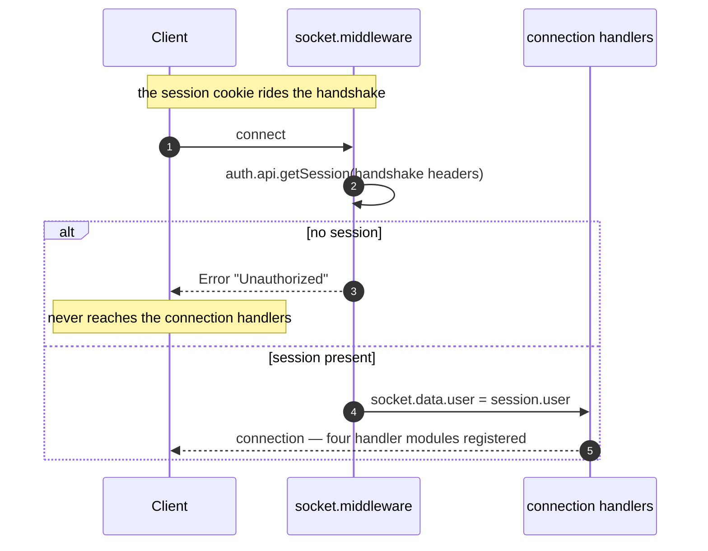
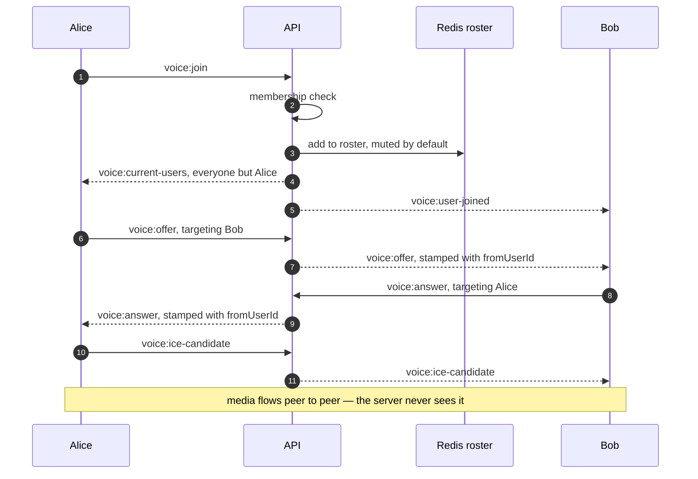

# Realtime

Every live feature in Nimbus — chat, presence, typing indicators, document and canvas collaboration,
voice — runs over **one authenticated Socket.IO connection per browser tab**. This document covers
the socket layer itself: the handshake, the room model, the full event contract, presence and voice,
and what happens when you run more than one instance.

The two collaboration models (Yjs CRDT for Markdown, last-write-wins for canvas) are deep enough to
have their own page: [document-sync.md](document-sync.md). This page covers everything around them.

## Contents

- [One connection, four domains](#one-connection-four-domains)
- [The connection lifecycle](#the-connection-lifecycle)
- [Rooms](#rooms)
- [The event contract](#the-event-contract)
- [Chat, presence and typing](#chat-presence-and-typing)
- [Voice](#voice)
- [Redis-backed state](#redis-backed-state)
- [Scaling](#scaling)
- [Design decisions and trade-offs](#design-decisions-and-trade-offs)
- [Related documentation](#related-documentation)

## One connection, four domains

`createIoServer` in `apps/api/src/app.ts` registers four handler modules for every authenticated
socket:

```ts
io.on("connection", (socket) => {
  registerChatHandlers(io, socket); // socket/chat.ts
  registerDocumentHandlers(io, socket); // socket/document.ts
  registerCanvasHandlers(io, socket); // socket/canvas.ts
  registerVoiceHandlers(io, socket); // socket/voice.ts
});
```

Each module registers its own `socket.on(...)` listeners and manages its own room membership. They
are separate because their state models are genuinely different:

| Domain          | State model                  | Where state lives | Persistence                        |
| --------------- | ---------------------------- | ----------------- | ---------------------------------- |
| Chat / presence | Rooms + Redis set            | Redis             | `Message` rows                     |
| Typing          | Fire-and-forget relay        | nowhere           | none                               |
| Markdown        | CRDT (Yjs)                   | process memory    | `Document.yjsState`, 5s debounce   |
| Canvas          | Last-write-wins              | process memory    | `Document.canvasData`, 3s debounce |
| Voice           | Signaling relay + Redis hash | Redis             | none                               |

A client does not open a socket per document. It opens one socket and joins a room per document it
has open. Switching tabs means leaving one room and joining another.

## The connection lifecycle



That split is the origin of the socket layer's main invariant: because the handshake resolved the
session once, **every handler can trust `socket.data.user` and must not re-authenticate** — but it
still has to check authorization per event, which is the next section.

### 1. Handshake authentication

`apps/api/src/middleware/socket.middleware.ts` runs during the handshake, **before** `connection`
fires:

```ts
io.use(async (socket, next) => {
  const session = await auth.api.getSession({
    headers: fromNodeHeaders(socket.handshake.headers),
  });
  if (!session) return next(new Error("Unauthorized"));
  socket.data.user = session.user;
  next();
});
```

The session cookie travels with the handshake, so authentication happens once per connection rather
than once per event. A rejected handshake never reaches the `connection` handlers at all.

This produces the single most important invariant of the socket layer:

> **Every handler can trust `socket.data.user` and must not re-authenticate.**

Handlers that repeat the session lookup are doing wasted work on every event. What they _must_ do
instead is re-check **authorization** — see below.

### 2. Per-event authorization

Authentication says who you are. It does not say what you may touch, and workspace membership can be
revoked while a socket is open. So every state-mutating handler re-checks membership at event time:

```ts
socket.on("message:send", async (data) => {
  const member = await prisma.workspaceMember.findUnique({
    where: {
      userId_workspaceId: { userId: user.id, workspaceId: data.workspaceId },
    },
  });
  if (!member) return;
  // …
});
```

The document and canvas modules use a cheaper equivalent: they check room membership, because only a
socket that passed the membership gate at `doc:join` / `canvas:join` can be in the room. That turns a
query per keystroke into a set lookup while remaining exactly as strong:

```ts
if (!socket.rooms.has(DOC_ROOM(docId))) {
  return socket.emit("doc:error", "Not joined to document");
}
```

Either way, the rule is the same: **membership is checked per event, not per connection.**

### 3. Disconnecting, not disconnect

Teardown handlers use `disconnecting` rather than `disconnect`:

```ts
socket.on("disconnecting", async () => {
  /* … */
});
```

The difference is load-bearing. `disconnecting` fires while the socket is **still listed in its
rooms**, which is the only moment the code can see _which_ rooms to clean up. By the time
`disconnect` fires, `socket.rooms` is empty and the information is gone. Every module's cleanup —
presence removal, voice roster eviction, document snapshot-and-evict — depends on this.

## Rooms

Socket.IO rooms are the addressing mechanism. Nimbus uses five kinds:

| Room      | Named                 | Joined by        | Purpose                              |
| --------- | --------------------- | ---------------- | ------------------------------------ |
| Workspace | `<workspaceId>`       | `workspace:join` | Chat, presence, typing, AI events    |
| Document  | `doc:<documentId>`    | `doc:join`       | Markdown Yjs relay                   |
| Canvas    | `canvas:<documentId>` | `canvas:join`    | Canvas state relay                   |
| Voice     | `voice:<workspaceId>` | `voice:join`     | Signaling fan-out and roster events  |
| Socket    | `<socketId>`          | implicit         | Point-to-point (Socket.IO's default) |

Note that the workspace room is named by the raw workspace id with no prefix, while the others are
prefixed. That is why cleanup code filters with `room.startsWith("doc:")` and, in chat, with
`room !== socket.id`.

## The event contract

Event names follow **`namespace:verb`** and are typed once in
`packages/types/src/socket/socketEvents.ts` as `ClientToServerEvents` and `ServerToClientEvents`.
Both the server handlers and the typed client singleton are checked against those types — adding an
event means adding it to the type first, or neither side compiles.

### Client → server

| Event                          | Payload                                    | What it does                                                           |
| ------------------------------ | ------------------------------------------ | ---------------------------------------------------------------------- |
| `workspace:join`               | `workspaceId`                              | Membership check → join room → Redis presence → notify + replay roster |
| `workspace:leave`              | `workspaceId`                              | Leave room → remove from presence → notify                             |
| `message:send`                 | `{ workspaceId, content }`                 | Persist message, broadcast, trigger bot on `@nimbusbot`                |
| `typing:start` / `typing:stop` | `workspaceId`                              | Ephemeral relay to the room, excluding sender                          |
| `doc:join`                     | `docId`                                    | Membership-gated; replies with `doc:state`                             |
| `doc:update`                   | `docId, number[]`                          | Binary Yjs update; applied, relayed, debounce-saved                    |
| `doc:leave`                    | `docId`                                    | Snapshot + evict when the room drains                                  |
| `canvas:join`                  | `canvasId`                                 | Membership-gated; replies with `canvas:state`                          |
| `canvas:update`                | `{ documentId, elements, initialized }`    | Full-state replace, relayed, debounce-saved                            |
| `canvas:leave`                 | `canvasId`                                 | Snapshot + evict when the room drains                                  |
| `voice:join` / `voice:leave`   | `workspaceId`                              | Roster add/remove + room join/leave                                    |
| `voice:offer`                  | `{ workspaceId, targetUserId, offer }`     | Relayed to one peer                                                    |
| `voice:answer`                 | `{ workspaceId, targetUserId, answer }`    | Relayed to one peer                                                    |
| `voice:ice-candidate`          | `{ workspaceId, targetUserId, candidate }` | Relayed to one peer                                                    |
| `voice:mute-state`             | `{ workspaceId, isMuted }`                 | Roster patch + broadcast                                               |

### Server → client

| Event                                                  | Payload                                    | Emitted when                                         |
| ------------------------------------------------------ | ------------------------------------------ | ---------------------------------------------------- |
| `message:new`                                          | `Message`                                  | A message is persisted (user or bot)                 |
| `presence:joined`                                      | `{ userId, name }`                         | Someone joins the workspace                          |
| `presence:left`                                        | `{ userId }`                               | Someone leaves or disconnects                        |
| `presence:online_users`                                | `string[]`                                 | Full roster, sent to a joiner                        |
| `typing:start` / `typing:stop`                         | `{ userId, name }`                         | Relayed from another client                          |
| `workspace:error`                                      | `string`                                   | A `workspace:join` or `voice:join` from a non-member |
| `doc:state`                                            | `number[]`                                 | Full Yjs state on join                               |
| `doc:update`                                           | `number[]`                                 | Remote Yjs update to apply                           |
| `doc:error`                                            | `string`                                   | Document operation rejected                          |
| `canvas:state`                                         | `{ documentId, elements }`                 | Full element array on join                           |
| `canvas:update`                                        | `{ documentId, elements }`                 | Remote full-state replacement                        |
| `canvas:error`                                         | `string`                                   | Canvas operation rejected                            |
| `doc:ai:start`                                         | `{ type, label }`                          | Bot started generating                               |
| `doc:ai:thinking`                                      | `{ token }`                                | A reasoning token streamed                           |
| `doc:ai:complete`                                      | `{ documentId, label, type, canvasData? }` | Generation finished                                  |
| `doc:ai:error`                                         | `{ message }`                              | Generation failed                                    |
| `ai:refused`                                           | `{ feature, reason, message, cta }`        | Entitlement refusal — **asking socket only**         |
| `voice:user-joined` / `voice:user-left`                | `{ userId, name? }`                        | Voice roster changed                                 |
| `voice:current-users`                                  | `{ users }`                                | Voice roster snapshot to a joiner                    |
| `voice:offer` / `voice:answer` / `voice:ice-candidate` | `{ fromUserId, … }`                        | Relayed signaling                                    |
| `voice:mute-state`                                     | `{ userId, isMuted }`                      | A peer muted or unmuted                              |

Two emission-scope details matter and are easy to get wrong:

- **`socket.to(room)` excludes the sender; `io.to(room)` includes it.** Typing relays and Yjs/canvas
  updates use `socket.to` so the originator does not receive an echo of its own change. Roster
  announcements like `presence:joined` use `io.to` so everyone, including the joiner, converges.
- **`ai:refused` is emitted to the socket, never to the room.** A quota exhaustion is a personal
  fact; broadcasting it would leak it to the workspace and open a phantom `GENERATING` tab for every
  participant. See [document-generation.md](document-generation.md#failures-and-refusals).

## Chat, presence and typing

### Presence is a Redis set

`apps/api/src/lib/presence.ts` keeps one Redis Set per workspace, `presence:<workspaceId>`:

```ts
await pubClient.sadd(key, userId);
await pubClient.expire(key, 86400, "NX");
```

Set semantics make join and leave **idempotent** — a duplicate `workspace:join` from a second tab
does not double-count a user, and a leave for someone who never joined is a no-op. The 24-hour TTL
(`NX`, so it is only set when the key has no TTL) is a stale-data guard for the case where a process
dies without cleaning up; normal leaves remove members explicitly.

`presenceService` emits no socket events itself. The emitting lives in `socket/chat.ts`, which keeps
the storage layer free of transport concerns and independently testable.

### Typing is deliberately ephemeral

```ts
socket.on("typing:start", (workspaceId: string) => {
  socket
    .to(workspaceId)
    .emit("typing:start", { userId: user.id, name: user.name });
});
```

Typing indicators are never persisted and never stored in Redis. They are high-frequency, worthless
after a second, and would be pure write amplification. The client debounces them; the server just
relays. Note this handler performs no membership check — it emits to a room the sender may not be in,
which fails closed (a non-member is not in the room, so nothing is delivered).

### `workspace:error`

A refused `workspace:join` is reported rather than silently dropped:

```ts
if (!member) {
  return socket.emit("workspace:error", "Not a member of this workspace");
}
```

Without it, the client would sit connected but non-functional, unable to distinguish "denied" from
"still connecting". `voice:join` reuses the same event for the same reason.

## Voice

### The server never touches media

`apps/api/src/socket/voice.ts` is a **pure signaling relay**. Audio flows peer-to-peer over WebRTC;
the server only forwards three message types:

```ts
socket.on("voice:offer", (data) => {
  const targetSocket = getSocketByUserId(io, data.targetUserId);
  if (!targetSocket) return;
  targetSocket.emit("voice:offer", { fromUserId: user.id, offer: data.offer });
});
```

The server does not inspect SDP. It stamps the sender's id and forwards. A missing target means that
peer left or reconnected — safe to drop, because the mesh heals on the next join event.



`getSocketByUserId` is an **O(n) scan** over `io.sockets.sockets`. That is fine on a single box and is
flagged in the module for what it is: a `userId → socketId` index becomes necessary past single-box
load.

### The roster is a Redis hash

`apps/api/src/lib/voicePresence.ts` uses a Hash per workspace (`voice_presence:<workspaceId>`, field =
userId, value = JSON `VoiceUser`) rather than the Set that chat presence uses. The reason is mute
state: a hash gives an O(1) per-field update, so toggling mute patches one field instead of
rewriting the roster. It is a read-modify-write on a single field, which is safe because only the
owning user ever writes their own flag.

Joiners start muted (`isMuted: true`), and the roster snapshot sent to a joiner excludes the joiner —
they already know their own state, and the client opens one peer connection per entry in that list.

### TURN credentials are minted per request

`apps/api/src/lib/turnCredentials.ts` implements the coturn REST API scheme:

```ts
const username = `${expiryTimestamp}:${userId}`;
const credential = HMAC - SHA1(TURN_SECRET, username).toString("base64");
```

The username carries a 24-hour expiry that coturn itself enforces, so the servers only need roughly
synchronized clocks. `controllers/turn.controller.ts` pairs these with public STUN servers and the
configured `TURN_SERVER_URL`, returning a ready `iceServers` array over the authenticated
`/api/turn` route. Coturn runs as the `coturn` service in `docker-compose.yml` and trusts
`TURN_SECRET`.

This is why credentials are minted rather than shared: a static TURN password in the client bundle
would let anyone relay traffic through the operator's server indefinitely.

## Redis-backed state

Redis serves three distinct purposes, and conflating them causes confusion:

1. **Presence and voice rosters** — actual data, in sets and hashes, with TTL guards.
2. **Typing** — not stored at all; relayed only.
3. **Broadcast fan-out** — the `@socket.io/redis-adapter`, attached in `app.ts`:

```ts
io.adapter(createAdapter(pubClient, subClient));
```

The adapter is what makes a broadcast on instance A reach a client connected to instance B. It
carries **events**, not document state — the distinction that the next section turns on.

Redis transport selection has its own subtlety: TLS is derived from the connection string's _host_,
not just its scheme, because a managed Redis addressed as `redis://some.host.example.com` may still
require TLS. `apps/api/src/lib/redis.ts` documents the derivation and a connect watchdog that logs
the silent-hang case; `REDIS_TLS` overrides it. See
[getting-started.md](getting-started.md#redis-tls-is-derived-not-assumed).

## Scaling

The Redis adapter makes **event fan-out** work across replicas. It does not make **document state**
work across replicas, because the `docs` and `canvases` maps are process-local.

With two API instances:

```text
Alice ── replica A ──┐
                     ├── both hold a Y.Doc for the same document
Bob ──── replica B ──┘
```

Live collaboration still _appears_ to work — Alice's update is applied on A, broadcast through Redis,
and merged by Bob on B. But the two replicas have divergent in-memory snapshots, and whichever saves
last wins in `yjsState`. A user joining on replica B can be served a snapshot missing Alice's edits.

Fixing it properly means either **sticky sessions** (route a document's participants to one replica —
cheap, preserves the design, but constrains the load balancer and breaks on replica failure) or a
**shared Yjs store** (correct, and the direction a production deployment should take). The full
analysis is in [document-sync.md](document-sync.md#scaling).

The voice socket lookup has the same shape of limitation for a different reason: `getSocketByUserId`
scans only the local process's sockets, so a peer connected to another replica will not be found.

**Sticky sessions are the practical single-box-plus answer today.** A shared store is the real fix.

## Design decisions and trade-offs

### Why one socket instead of one per feature?

Because the connection is expensive and the features are not independent. A user with a document
open is also in the workspace chat and may be in a voice call — three sockets would mean three
handshakes, three session lookups, and three connection states to keep consistent. One socket with
per-document rooms gives the same isolation with a single lifecycle.

### Why authenticate at the handshake rather than per event?

Because the handshake already carries the session cookie, and re-validating a session on every
keystroke would be a database round-trip per character typed. Authenticating once and then checking
_authorization_ per event is the correct split: identity is stable for the life of the connection,
permissions are not.

### Why check membership per event at all, if the handshake authenticated?

Because authentication and authorization are different questions, and revocation has to actually
revoke. A socket can stay open for days; checking membership only at connection time means a removed
member keeps full access until they happen to reconnect. The per-event check is one indexed query on
mutating events — cheap enough to be worth correct access control.

### Why is document/canvas `update` guarded by room membership rather than a membership query?

It is the same guarantee for a fraction of the cost. `doc:join` already proved membership before
admitting the socket to the room, so room membership is a sufficient proxy — and it is an in-memory
set lookup rather than a query on every keystroke. Without either check, any authenticated socket
that knew a document id could mutate a live document and have the change broadcast and persisted.

### Why is typing not persisted or stored in Redis?

Because it has a useful lifetime measured in seconds and a high update frequency. Storing it would be
write amplification for data that is worthless by the time it is read, and it would need its own
expiry logic to avoid ghost indicators. A pure relay has neither problem: if the packet is lost, the
user simply stops seeing an indicator that was about to disappear anyway.

### Why does the server not inspect SDP for voice?

Because media negotiation is between peers. The server's only job in a WebRTC mesh is to get the two
sides' offers, answers and ICE candidates to each other — it cannot improve on them and inspecting
them would mean parsing a format that changes with browser versions. Stamping `fromUserId` and
forwarding is the entire contract, which is why the voice module is the smallest of the four.

### Why mint TURN credentials per request instead of shipping a static password?

Because a static credential in a client bundle is public. Anyone could extract it and relay arbitrary
traffic through the operator's TURN server on the operator's bandwidth. Time-limited credentials
bound to a user id mean a leaked credential expires within 24 hours and is attributable to an
account.

### Why is `presence` a Set while `voice` is a Hash?

Because of their update patterns. Presence is join/leave only, where Set semantics give free
idempotency. Voice needs per-user mute updates, and patching one field of a Hash is O(1) where a Set
would require removing and re-adding the whole serialized member. Same backing store, different
shape, chosen per access pattern.

## Related documentation

- [document-sync.md](document-sync.md) — the Yjs and canvas sync models in full.
- [document-generation.md](document-generation.md) — the `doc:ai:*` and `ai:refused` events.
- [api.md](api.md) — the REST surface, including `/api/turn`.
- [architecture.md](architecture.md) — where the socket server sits in the two-process model.
- [testing.md](testing.md) — the socket integration suites (`chat`, `document`, `canvas`, `voice`,
  `redis-adapter`, `yjs.convergence`).
